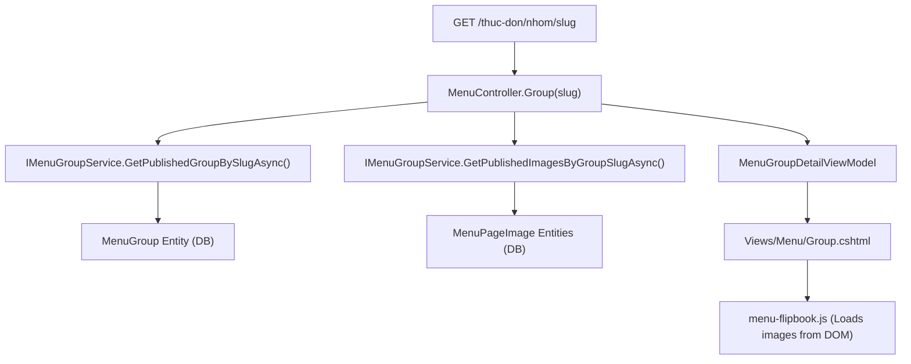
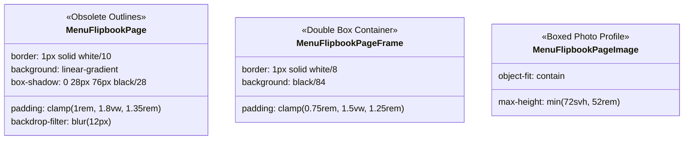
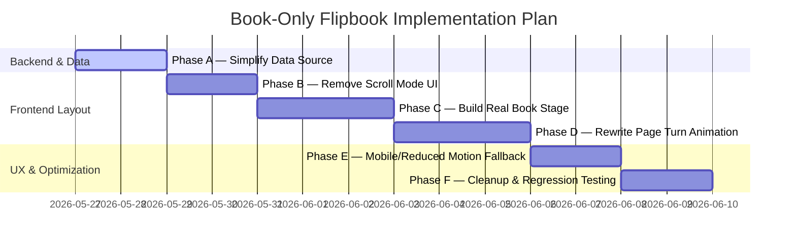

# Menu Group Flipbook Deep Audit Report

---

## 1. Executive Summary

This deep audit report evaluates the public Menu Group detail page (`/thuc-don/nhom/{slug}`) of the **KIGHolding / Truyền Thuyết Champong** website. The goal of this audit is to assess the feasibility, risks, and concrete steps required to transition the current dual-mode experience (Scroll vs. Book Mode) into a premium, focused, **book-only experience**. 

### Current State
The current page renders both a vertical scroll grid of individually bordered image cards and an overlay-style "dual-page spread" flipbook. Users can toggle between these modes. Visually, the experience is cluttered with helper instructions, navigation sidebars, and boxed frame elements that make the menu images feel like raw photos in card containers rather than full-bleed pages in a real premium restaurant menu. 

### Core Audited Findings
1. **Strong JavaScript-to-DOM Dependency:** The current `menu-flipbook.js` relies entirely on scraping image sources from the rendered scroll-list cards. Deleting the scroll list in Razor will cause the script to exit silently and break the page.
2. **Double-Border Box Styling:** The flipbook pages are double-wrapped in border-heavy, rounded container frames (`.menu-flipbook__page` and `.menu-flipbook__page-frame`) with custom black backgrounds and inset shadows. This destroys the illusion of paper pages.
3. **Invasive Navigation Controls:** The sidebar and top control panel occupy substantial screen real estate and contain technical instructions (e.g., *"Chế độ sách hiển thị tốt nhất..."*), detracting from the premium, cinematic brand alignment.
4. **Z-Index and Spacing Conflicts:** On mobile and tablet viewports, the floating contact drawer and sticky header overlap or restrict the height available for the flipbook spread.

### Feasibility of a Book-Only Experience
Transitioning the page to a **book-only experience** is **highly feasible** and recommended. To do so without breaking functionality, we must:
- Replace the visible DOM scroll cards with a lightweight, hidden JSON data block in the Razor view.
- Re-architect `menu-flipbook.js` to parse this JSON rather than scraping visible cards.
- Restyle the CSS stage, spine, and gutter in `input.css` to build an authentic three-dimensional page-turning book stage.

---

## 2. Current Route and Rendering Chain

The request is handled cleanly through ASP.NET Core MVC routing. Below is the complete rendering chain from database entities to the client-side view:



### Detailed Rendering Chain Specs
* **Route:** `/thuc-don/nhom/{slug}` (Attribute routing defined on `MenuController` as `[Route("thuc-don")]` and action `[HttpGet("nhom/{slug}")]`).
* **Controller Action:** `MenuController.Group(string slug, CancellationToken cancellationToken)` (located in `Controllers/MenuController.cs#L52-114`).
* **View File:** `Views/Menu/Group.cshtml` (dependent on standard `Views/Shared/_Layout.cshtml` layout template).
* **ViewModel:** `MenuGroupDetailViewModel` (located in `ViewModels/MenuGroupViewModels.cs#L28-41`).
* **Services Involved:** 
  - `IMenuGroupService` -> Loads `MenuGroup` records and cascading `MenuPageImage` items using EF Core and PostgreSQL contexts.
* **Data Passed into the Page:**
  * `Name` (`string`): The name of the menu group (e.g., *Truyền Thuyết Champong*).
  * `Slug` (`string`): Sluggified group path.
  * `ShortDescription` (`string`): Dynamic description from database or hardcoded fallback.
  * `Description` (`string`?): Comprehensive narrative text.
  * `CoverImageUrl` (`string`?): Group thumbnail. Falls back to first page image if cover is null.
  * `FirstImageUrl` (`string`?): URL of the first menu page image.
  * `BackUrl` (`string`): Breadcrumb destination (`/thuc-don`).
  * `GroupUrl` (`string`): Absolute canonical path (`/thuc-don/nhom/{slug}`).
  * `TotalPages` (`int`): Count of published page sheets.
  * `HasImages` (`bool`): Operational check flags.
  * `Images` (`IReadOnlyList<MenuPageImageViewModel>`): List of pages containing:
    * `ImageUrl` (`string`)
    * `AltText` (`string`?)
    * `DisplayOrder` (`int`)
    * `PageNumber` (`int`)

---

## 3. Current Visible UI Inventory

| UI Element | Current Purpose | Source File | Relevant Selector / JS Hook | Keep / Remove / Redesign | Notes |
| :--- | :--- | :--- | :--- | :--- | :--- |
| **Back Button** | Inline navigation guiding users back to the menu hub. | `Group.cshtml` (Line 18) | `href="@Model.BackUrl"` | **Keep** | Essential for user experience. Move into a subtle breadcrumb layout. |
| **Page Header / Hero** | Renders Title, Description, CTAs, and Cover image. | `Group.cshtml` (Lines 32-83) | `menu-group-viewer__hero-media` | **Redesign** | Currently too tall. Reduce vertical padding and size to bring the book viewer above the fold. |
| **Info / Label Text** | Informs users that images are sorted by display order. | `Group.cshtml` (Lines 91-93) | Hardcoded text block | **Remove** | Unnecessary distraction that contributes to an "admin preview" feel. |
| **View Mode Toggle** | Controls switching between "Xem dạng sách" and "Xem dạng cuộn". | `Group.cshtml` (Lines 98-128) | `[data-menu-viewer-controls]` / `[data-menu-view-toggle]` | **Remove** | Unnecessary once the page becomes book-only. |
| **Helper text** | *"Chế độ sách hiển thị tốt nhất..."* label next to page count. | `Group.cshtml` (Line 124) | Hardcoded label | **Remove** | Technical noise that degrades the premium dining brand feel. |
| **Flipbook Shell** | Outer container containing header, controls, and stages. | `Group.cshtml` (Lines 130-166) | `[data-menu-flipbook]` | **Redesign** | Eliminate the container border/background; make it a full-viewport stage. |
| **Book Stage** | Target insertion div where page images are rendered by JS. | `Group.cshtml` (Line 163) | `[data-menu-flipbook-stage]` | **Redesign** | Re-style to support authentic book thickness, spinal shadows, and turning curves. |
| **Sidebar Navigation** | Right/left-hand side navigation card with page jumps. | `Group.cshtml` (Lines 169-202) | `[data-menu-scroll-viewer] > aside` | **Remove / Redesign** | Unnecessary sidebar. Page jumps can be integrated as thumbnails or dot bars below the book. |
| **Scroll Mode Card List** | Vertical list displaying cards containing menu page images. | `Group.cshtml` (Lines 204-244) | `[data-menu-scroll-page]` | **Remove** | CRITICAL: The markup must be removed from the visible DOM, but its data must be preserved as JSON. |
| **CTA Block (Booking)** | Prompt at bottom of page urging table reservations. | `Group.cshtml` (Lines 274-299) | Section containing reservation links | **Keep** | Essential business CTA. Ensure it fits below the final viewer. |
| **Floating Buttons** | Pinned elements on desktop (`Call`/`Book`) and mobile. | `_FloatingContactButtons.cshtml` | `.fixed.bottom-24.right-5` | **Keep** | Global contact anchors. Must ensure book controls or spreads do not overlap. |

---

## 4. Razor Audit (`Views/Menu/Group.cshtml`)

### 4.1 Header / Hero Panel Block (Lines 12 - 83)
* **What it renders:** Breadcrumb, Badge, Brand Name Title, Description, "Xem các trang menu" anchor link, and Cover Image Frame.
* **Book-Only Need:** Needed for SEO, title, and initial brand presentation.
* **Removal Potential:** The structural panel must stay, but its size must be minimized. The Cover Image Frame (`menu-group-viewer__hero-media`) is redundant because the book itself will render the cover page on page 1 of the spread.
* **Future Replacement:** Remove the cover image container and condense the header text into a slim single-column intro bar above the book stage.

### 4.2 Mode Toggles Container (Lines 98 - 128)
* **What it renders:** The container `data-menu-viewer-controls`, carrying mode buttons `[data-menu-view-toggle]` ("Xem dạng sách" / "Xem dạng cuộn") and instruction text.
* **Book-Only Need:** Unnecessary.
* **Removal Potential:** **100% removable.**
* **Future Replacement:** Remove completely. The parent container element can be eliminated entirely, saving substantial DOM space and layout complexity.

### 4.3 Flipbook Container & Controls (Lines 130 - 166)
* **What it renders:** Outer wrapper container, sub-header, previous/next buttons (`[data-menu-flipbook-prev]`, `[data-menu-flipbook-next]`), indicator, and stage (`data-menu-flipbook-stage`).
* **Book-Only Need:** **Core Component.**
* **Removal Potential:** Cannot be removed, but requires a significant layout clean-up.
* **Future Replacement:** 
  - Remove the outer card container classes (`border border-white/10 bg-white/[0.045] p-5 shadow-[0_30px_86px_rgba(0,0,0,0.3)] backdrop-blur`).
  - Keep the controls and indicator, but make them float elegantly above or sit centered beneath the book stage.

### 4.4 Sidebar Quick Navigation (Lines 169 - 202)
* **What it renders:** A sticky sidebar card (`aside`), showing the list of available pages as button tags (`Trang 01`, `Trang 02`), a back CTA, and reservation CTA.
* **Book-Only Need:** Unnecessary.
* **Removal Potential:** **Highly removable.**
* **Future Replacement:** Remove completely. Replace the vertical sidebar layout with a clean horizontal slider of tiny page thumbnails or an elegant navigation progress bar below the stage.

### 4.5 Vertical Scroll Pages Loop (Lines 204 - 244)
* **What it renders:** Renders each `MenuPageImage` within an `<article class="menu-group-viewer__page">` container carrying a text header, alt descriptions, a link, and a large image container.
* **Book-Only Need:** Unnecessary for presentation.
* **Removal Potential:** **100% removable from the visible layer.**
* **Future Replacement:** Replace this entire loop with a hidden data container. Rather than rendering visible HTML nodes containing huge images, serialize the viewmodel into a hidden HTML5 `data-*` attribute or a `<script>` tag carrying the images in JSON format:
  ```html
  <div id="flipbook-data" data-images="@Json.Serialize(Model.Images)" hidden></div>
  ```

---

## 5. JavaScript Audit (`wwwroot/js/menu-flipbook.js`)

### 5.1 Current Logic and Discovery Flow
1. **DOM Scraper:** On DOM load, the script queries `[data-menu-group-viewer]` and exits if not found.
2. **Page Extraction (The Bottleneck):** The script executes:
   ```javascript
   var scrollPages = Array.prototype.slice.call(root.querySelectorAll("[data-menu-scroll-page]"));
   ```
   It iterates over these nodes, locating the `` and `[data-menu-open-image]` elements to parse the `src` and `alt` properties. 
3. **Mode Assignment:** Sets default mode (`scroll` on mobile, `book` on desktop) using `setMode()`.
4. **State Management:** Tracks current spread indices using `currentIndex`. Clamps and resolves next/previous offsets using steps of `1` (single page) or `2` (desktop spread).
5. **DOM Generation:** Dynamically generates `<article class="menu-flipbook__page">` templates for active pages, appending them to `[data-menu-flipbook-stage]`.
6. **Key Navigation:** Listens to `ArrowLeft` and `ArrowRight` to increment page spreads.

### 5.2 Required Changes for Book-Only Mode
1. **Remove DOM Scraper:** Replace the scraper block with a direct JSON parse from a hidden container:
   ```javascript
   var dataNode = document.getElementById("flipbook-data");
   var pages = JSON.parse(dataNode.getAttribute("data-images"));
   ```
2. **Eliminate Mode Toggles:** Delete all code referencing `state.mode`, `setMode`, `toggleButtons`, and `scrollViewer`.
3. **Refactor Responsive Behavior:** 
   - Instead of fallback to scroll mode on mobile, keep book mode active but automatically switch layout configuration to single-page rendering (`isSinglePageMode()` returning true).
   - Use swipe-based touch events (e.g., standard touchstart/touchend delta checks) to turn pages on mobile.
4. **Obsolete Functions to Remove:**
   - `setMode(mode)`
   - `updateModeButtons()`
   - `toggleButtons.forEach(...)`
5. **Functions to Preserve & Refactor:**
   - `renderPages(direction)`: Essential for DOM updates on page transition.
   - `goToPrevious()`, `goToNext()`, `clampIndex(index)`, `getVisiblePages()`: Essential state rules.
   - `handleKeydown()`: Preserve for accessibility, but remove the mode check.

---

## 6. CSS Audit (`wwwroot/css/input.css`)

The styling for the book component must undergo a massive transformation to remove card borders and achieve a realistic book spread. Below is an audit of the relevant Tailwind and vanilla classes defined in `input.css` (Lines 940 - 1225):



### Selector Inventory & Audit Details

#### `.menu-group-viewer__page` (Lines 962-970)
* **Current Action:** Configures borders, backgrounds, and drop shadows for the vertical scroll list items.
* **Audit Evaluation:** **Obsolete.** Will be removed when scroll mode is deleted.

#### `.menu-group-viewer__page-frame` (Lines 972-984)
* **Current Action:** Configures internal frames with borders and padding for scroll images.
* **Audit Evaluation:** **Obsolete.** Will be removed.

#### `.menu-flipbook__toggle` (Lines 986-1004)
* **Current Action:** Buttons used to toggle view mode (red background when active).
* **Audit Evaluation:** **Obsolete.** Safe to remove.

#### `.menu-flipbook__shell` (Lines 1006-1009)
* **Current Action:** Sets background and transparency overlays for the outer flipbook card.
* **Audit Evaluation:** **Harmful Outline Source.** This adds a massive border card around the entire book environment.
* **Remediation:** Remove borders and background to let the book sit directly on the premium page background.

#### `.menu-flipbook__controls` (Lines 1011-1017)
* **Current Action:** Houses navigation buttons.
* **Audit Evaluation:** **Preserve.**

#### `.menu-flipbook__button` (Lines 1019-1044)
* **Current Action:** "Trước" and "Sau" pill buttons.
* **Audit Evaluation:** **Preserve.** Consider styling them as sleek floating side-arrows for a more premium look.

#### `.menu-flipbook__indicator` (Lines 1046-1053)
* **Current Action:** Renders "Trang X - Y / Total".
* **Audit Evaluation:** **Preserve.**

#### `.menu-flipbook__stage` (Lines 1059-1092)
* **Current Action:** Flex grid layout. Contains basic 3D perspective transition animations (`is-turning-next`, `is-turning-prev` executing `rotateY`).
* **Audit Evaluation:** **Needs Redesign.** Currently, the rotation is very basic (translating slightly on X and rotating by 9 degrees). It lacks proper page depth, paper thickness, or dynamic page curls.
* **Remediation:** Rewrite rotation values and origins to establish a realistic 3D spine hinge.

#### `.menu-flipbook__page` (Lines 1093-1120)
* **Current Action:** 
  ```css
  border: 1px solid rgba(255, 255, 255, 0.10);
  background: linear-gradient(180deg, rgba(255, 255, 255, 0.06), rgba(255, 255, 255, 0.03));
  padding: clamp(1rem, 1.8vw, 1.35rem);
  box-shadow: 0 28px 76px rgba(0, 0, 0, 0.28);
  ```
* **Audit Evaluation:** **MAJOR REALISM VIOLATION.** This adds the visible card outline, background gradient, and padding that makes the menu page look like a photo placed inside a plastic holder.
* **Remediation:** 
  - Remove the background gradient, border, and backdrop-filter.
  - Set borders to `none`.
  - Add page depth shadows using HSL or semi-transparent black values on the outer side of each page.

#### `.menu-flipbook__page-frame` (Lines 1155-1168)
* **Current Action:** 
  ```css
  border: 1px solid rgba(255, 255, 255, 0.08);
  background: rgba(7, 7, 7, 0.84);
  padding: clamp(0.75rem, 1.5vw, 1.25rem);
  ```
* **Audit Evaluation:** **DOUBLE BOXING SOURCE.** This creates a thick inner frame around the menu sheet.
* **Remediation:** Remove borders, backgrounds, padding, and inset shadows. Let the page image occupy 100% of the page container (full-bleed).

#### `.menu-flipbook__page-image` (Lines 1170-1176)
* **Current Action:** Displays the menu sheet with `object-fit: contain` and limits height to `72svh`.
* **Audit Evaluation:** **Needs Redesign.** Currently boxed within the padded frames.
* **Remediation:** Set `width: 100%`, `height: 100%`, and `object-fit: cover` or `contain` depending on the desired aspect ratio to ensure full-bleed presentation on the page spread.

---

## 7. Backend / ViewModel Audit

No dynamic database schema modifications, migration updates, or EF Core changes are required for this refactor. The backend already provides structured data:

### Current Data Cleanliness
- **Ordering:** Images are ordered correctly by `DisplayOrder` in `MenuController.cs#L80-89` and mapping is properly calculated.
- **Alt Text:** Alt text fallbacks are generated dynamically: if `AltText` is empty, it outputs `"{GroupName} - Trang thực đơn {PageNumber}"` preventing empty tags.
- **Cover Fallback:** Done beautifully at `MenuController.cs#L91-94`. If `CoverImageUrl` is null, it falls back to the first sheet image, keeping routing stable.

### Suggested Backend Refactor (Optional but highly recommended)
Rather than scraping cards in JS, we can inject a clean, serialized JSON array into the view. In `Views/Menu/Group.cshtml`, we will add a hidden container block carrying the serialized images. This requires no changes to models, services, or entities.

---

## 8. Dependency Map

The visual structure relies on complex, intertwined dependencies between the Razor view, JS logic, and CSS classes:

```
[Razor DOM Structure]
  ├── article[data-menu-scroll-page] ──────────┐
  │     ├── img (src/alt)                      │ (Scrapes & parses metadata)
  │     └── a[data-menu-open-image]            │
  │                                            ▼
  ├── div[data-menu-viewer-controls] ──► [menu-flipbook.js] (Initialization)
  │                                            │
  │                                            ├─► Toggles [hidden] attributes
  │                                            │   on .menu-flipbook / [data-menu-scroll-viewer]
  │                                            │
  │                                            ▼
  └────────────────────────────────────► [CSS Classes applied to DOM]
                                               ├── .is-spread (desktop 2-page perspective)
                                               ├── .is-single (mobile stacked layout)
                                               ├── .is-turning-next (rotateY animations)
                                               └── .is-turning-prev (rotateY animations)
```

### Critical Dependency Considerations
- **Scraper Coupling:** The biggest hazard. Deleting the `<article>` tags in `Group.cshtml` will immediately crash `menu-flipbook.js` (raising errors or returning early on line 19).
- **Responsive Viewport Control:** The JS actively checks the viewport (`(max-width: 767px)`) and sets single-page modes. If scroll mode is deleted, CSS must handle the mobile view cleanly as a single page flip instead of falling back to a vertical scroll list.

---

## 9. Removal Candidate List

Below is a detailed list of codeblocks, styles, and markup elements that should be removed in the next implementation phase:

| Candidate | Location | Reason for Removal | Risk Level | Required Replacement |
| :--- | :--- | :--- | :--- | :--- |
| **"Xem dạng cuộn" Toggle** | `Group.cshtml` (Lines 111-116) | Unnecessary; the page will render in book-only mode. | **Low** | None. |
| **"Xem dạng sách" Toggle** | `Group.cshtml` (Lines 105-110) | Redundant with book-only experience. | **Low** | None. |
| **Toggle Outer Card Shell** | `Group.cshtml` (Lines 98-128) | Unnecessary container that clutters the UI. | **Low** | None. |
| **Sidebar Navigation Panel** | `Group.cshtml` (Lines 169-202) | Distracts from a premium menu experience. | **Medium** | A sleek, minimal horizontal pagination bar or dot list below the book. |
| **Scroll Mode Card List Loop** | `Group.cshtml` (Lines 204-244) | Heavy DOM nodes with cards, borders, and margins. | **High** | A hidden JSON data div: `div#flipbook-data[data-images]` to feed the JS engine. |
| **Mode Toggle CSS Styles** | `input.css` (Lines 986-1004) | No longer needed after removing the toggles. | **Low** | None. |
| **Scroll Page CSS Styles** | `input.css` (Lines 962-984) | No longer needed after removing the vertical list. | **Low** | None. |
| **Helper Label Text** | `Group.cshtml` (Lines 123-125) | Removes technical noise (*"Chế độ sách hiển thị tốt..."*). | **Low** | None. |

---

## 10. Redesign Candidate List

Elements that are retained but must be redesigned to elevate visual realism and premium brand alignment:

### 10.1 Previous/Next Navigation Controls
* **Current State:** Basic standard button elements pinned next to the page indicator.
* **Redesign Direction:** Convert into sleek, semi-transparent chevron indicators positioned on the outer left and right edges of the book spread, or support page turning by clicking on the edges of the page itself.

### 10.2 Current Page Indicator
* **Current State:** Text rendering `Trang 1 / 5` centered inside the header.
* **Redesign Direction:** Integrate as a small, elegant page number on the outer bottom corner of each page sheet (e.g., matching the style of a premium magazine).

### 10.3 Mobile Fallback
* **Current State:** Automatically forces scroll mode below `767px`.
* **Redesign Direction:** Render a focused single-page book layout. Support horizontal swiping transitions with physics-based drag-reveals instead of standard vertical scrolling.

### 10.4 Empty / Blank Page Behavior
* **Current State:** Renders a basic grey card with the text *"Trang trống - Trang này sẽ xuất hiện..."*.
* **Redesign Direction:** Render a high-end back-cover texture (e.g., textured charcoal leather with a subtle golden brand badge) when an odd number of pages is returned.

### 10.5 Book Stage / Background
* **Current State:** The book container rests directly on the general page background grid.
* **Redesign Direction:** Introduce a soft three-dimensional surface/table behind the book with radial gradients and dynamic drop shadows to create realistic depth.

### 10.6 Spine, Gutter, and Shadows
* **Current State:** No spine or gutter is rendered. The left and right pages look like two separate cards placed side-by-side.
* **Redesign Direction:** Add a central vertical division (spine) with a subtle dark gradient highlight on each inner edge. This creates the illusion of pages folding into a central gutter.

---

## 11. Risks and Regression Concerns

Transitioning to a premium book-only experience introduces several frontend and design risks that must be carefully managed:

* **Desktop Viewport Height Constrains:** If page images are wide or viewports are shallow, a full-bleed `clamp` could crop page bottoms or push controls off-screen.
  * *Mitigation:* Apply strict dynamic aspect-ratio CSS rules (`aspect-ratio: 1 / 1.4` or `max-height: 75vh`) to guarantee that the entire spread fits comfortably on standard screens.
* **Mobile Readability Risks:** Menus with small fonts are unreadable on mobile single-page viewports.
  * *Mitigation:* Ensure page double-tap zooms or add a sleek "Mở ảnh" zoom modal to view high-resolution sheets in full.
* **Sticky Header Overlaps:** The sticky public header (`.site-header`) uses `fixed` layout, which can overlap the top of the flipbook stage.
  * *Mitigation:* Ensure the book stage is offset with sufficient padding (`pt-24` or `pt-[6rem]`) to avoid overlaps.
* **Reduced-Motion Fallback:** Visitors with motion sensitivities or disabled animations might experience rendering issues if page transitions are mandatory.
  * *Mitigation:* Implement standard static cross-fades or instantaneous page updates when `prefers-reduced-motion` matches.
* **Search Engine Optimization (SEO):** Image scraping engines could miss images if they are only present in a hidden JSON container.
  * *Mitigation:* Render image paths within standard HTML `<noscript>` blocks or hidden `<a>` tag indexes to ensure search crawlers index the menu images.

---

## 12. Recommended Implementation Plan for a Future Phase

To ensure a smooth transition with zero downtime, we recommend a **six-stage structured implementation plan**:



### Phase A — Simplify Data Source
* **Goal:** Decouple JavaScript from visible scroll cards.
* **Files Affected:** `Views/Menu/Group.cshtml`, `wwwroot/js/menu-flipbook.js`.
* **Key Steps:**
  1. Add a hidden `<noscript>` block in `Group.cshtml` containing index links of the images for SEO.
  2. Serialize `Model.Images` into a hidden data container: `<div id="flipbook-data" data-images="@Json.Serialize(Model.Images)" hidden></div>`.
  3. Refactor `menu-flipbook.js` to parse this JSON data rather than querying `[data-menu-scroll-page]` elements.
* **Validation:** Verify that the page loads and flipbook works as expected on desktop while the scroll cards are still present in the DOM.

### Phase B — Remove Scroll Mode UI
* **Goal:** Eliminate view toggles, sidebar cards, helper descriptions, and the scroll card loop.
* **Files Affected:** `Views/Menu/Group.cshtml`, `wwwroot/js/menu-flipbook.js`.
* **Key Steps:**
  1. Safely remove the visible loop rendering the scroll cards.
  2. Remove the sidebar navigation block.
  3. Remove the view mode toggles and informational cards.
  4. Clean up all obsolete event listeners and code branches in `menu-flipbook.js`.
* **Validation:** Confirm that the flipbook functions properly on desktop and that there are no JavaScript errors in the console.

### Phase C — Build Real Book Stage
* **Goal:** Re-style the book presentation to feel like a premium, three-dimensional physical menu book.
* **Files Affected:** `wwwroot/css/input.css`, `Views/Menu/Group.cshtml`.
* **Key Steps:**
  1. Remove border cards and background gradients from `.menu-flipbook__page` and `.menu-flipbook__page-frame` to enable full-bleed images.
  2. Add a central spine divider styled with a vertical gradient gutter (`linear-gradient(90deg, rgba(0,0,0,0.4), transparent)`).
  3. Apply subtle outer page depth shadows using HSL tokens.
  4. Ensure that the viewport aspect ratio is configured cleanly (`aspect-ratio: 1.414 / 1` for spread).
* **Validation:** Visually inspect the layout to ensure it aligns with the Dark Premium theme.

### Phase D — Rewrite Page Turn Animation
* **Goal:** Elevate page-turning animations to simulate realistic paper flipping.
* **Files Affected:** `wwwroot/css/input.css`, `wwwroot/js/menu-flipbook.js`.
* **Key Steps:**
  1. Refactor transform-origin positions in `.menu-flipbook__page--left` (hinged on the right) and `.menu-flipbook__page--right` (hinged on the left).
  2. Apply premium keyframe scale adjustments during turn events to emulate real page curvature.
  3. Integrate soft shadows that expand and shrink dynamically during page transitions.
* **Validation:** Test that page-turning transitions are smooth on desktop.

### Phase E — Mobile/Reduced Motion Fallback
* **Goal:** Ensure high performance, accessibility, and intuitive controls on mobile devices.
* **Files Affected:** `wwwroot/js/menu-flipbook.js`, `wwwroot/css/input.css`.
* **Key Steps:**
  1. Configure `menu-flipbook.js` to render a single-page view on mobile.
  2. Implement swipe-based touch events (`touchstart`, `touchend`) to trigger page turns.
  3. Ensure that when `prefers-reduced-motion` matches, animations are disabled and pages switch instantly.
* **Validation:** Emulate mobile devices in Chrome DevTools to verify that touch sweeps and single-page transitions work flawlessly.

### Phase F — Cleanup and Regression Testing
* **Goal:** Ensure a stable, bug-free production release.
* **Files Affected:** All audited files.
* **Key Steps:**
  1. Run production CSS build processes to compile `site.css`.
  2. Verify that there are no z-index conflicts with the sticky header and floating CTA drawer.
  3. Check route compatibility with legacy single-item fallbacks (`/thuc-don/{slug}`).
* **Validation:** Run automated .NET builds to ensure complete system compilation.

---

## 13. Exact Files Likely to Change Later

When the future implementation phase is launched, the following files will require changes:

* **[ ]** `Views/Menu/Group.cshtml`
  * *Future Role:* Condense the page header. Add a serialized JSON script block. Remove the toggles, sidebars, and vertical card loop markup.
* **[ ]** `wwwroot/js/menu-flipbook.js`
  * *Future Role:* Rewrite to parse JSON data. Remove all mode toggles. Implement touch sweep events for mobile.
* **[ ]** `wwwroot/css/input.css`
  * *Future Role:* Clean up obsolete classes. Rewrite `.menu-flipbook__page` styles to remove double borders, add a central spine, and implement a realistic 3D page spread.

---

## 14. Build and Test Commands

To verify compilation and test code safety after future changes, use the following commands:

* **Tailwind Compile:**
  ```powershell
  npm run build:css
  ```
  *(Compiles source selectors inside `wwwroot/css/input.css` into the final minified target `wwwroot/css/site.css`)*

* **Project Build:**
  ```powershell
  dotnet build
  ```
  *(Ensures the ASP.NET Core project compiles with no C# syntax errors or controller mapping issues)*
