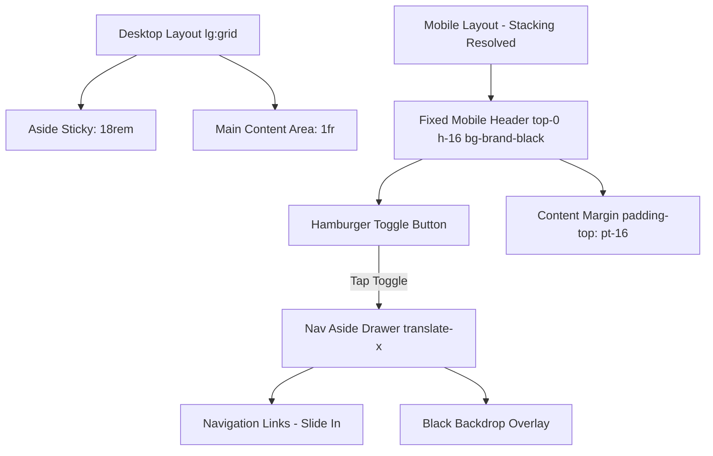

# Admin Layout and Navigation Audit

This document reviews the outer shell layout and navigation system defined in [\_AdminLayout.cshtml](file:///f:/Coding/Web%20development/KIG%20Holding/KIGHolding/Areas/Admin/Views/Shared/_AdminLayout.cshtml) and related assets.

## Layout Files

The admin panel shell layout is governed by:
*   `Areas/Admin/Views/Shared/_AdminLayout.cshtml`: HTML skeleton, navigation aside, header toolbar, toaster, and global asset registrations.
*   `wwwroot/css/input.css`: Compiles base layout classes and defines color branding.
*   `wwwroot/js/admin.js`: Page preview scripts; currently contains no layout or navigation drawer logic.

## Sidebar Structure

The sidebar (`<aside>`) contains:
*   **Branding (Lines 29-37)**: Brand logo, "Quản trị nội bộ" title, and "KIG Holding" kicker.
*   **Navigation Links (Lines 39-88)**: 8 links ("Tổng quan", "Quản lý Đặt bàn", "Quản lý Liên hệ", "Nhóm thực đơn", "Bài viết", "Đánh giá", "Quản lý Chi nhánh", "Cấu hình Website") wrapped in a `<nav>` container.
*   **External Link (Lines 90-94)**: "Xem website" ghost button that opens the public homepage in a new tab.

**Style declarations:**
```html
<aside class="border-b border-white/10 bg-brand-black text-white lg:sticky lg:top-0 lg:h-dvh lg:border-b-0 lg:border-r lg:border-white/10">
```
*   `bg-brand-black`: Dark theme canvas for the navigation (contrasting with the general light-themed workspace).
*   `lg:sticky lg:top-0 lg:h-dvh`: Desktop sidebar sticks to the left viewport and spans the full dynamic height.

## Topbar Structure

The topbar header (`<header>`) sits adjacent to the sidebar and contains:
*   **Page Title (Lines 101-104)**: Renders the active `ViewData["Title"]` and "Khu vực quản trị" kicker.
*   **User Identity (Lines 107-110)**: Displays `User.Identity.Name` and "SuperAdmin" role descriptor. Hidden on mobile (`hidden sm:block`).
*   **Logout Button (Lines 111-114)**: POST form block triggering the logout action.

**Style declarations:**
```html
<header class="border-b border-brand-border bg-white/90 backdrop-blur">
```
*   `bg-white/90 backdrop-blur`: Translucent light panel at the top of the content container.

## Content Container

The main content is wrapped in:
```html
<div class="min-w-0">
    <header>...</header>
    <main class="min-h-[calc(100svh-4rem)] px-4 py-6 sm:px-6 lg:px-8 lg:py-8">
        @RenderBody()
    </main>
</div>
```
*   `lg:grid lg:grid-cols-[18rem_1fr]` on the parent ensures the sidebar occupies `18rem` and the content container occupies the remaining width on desktop.

## Mobile Behavior

Below the `lg` breakpoint (1024px width), the grid structure (`lg:grid`) collapses into vertical block stacking:
1.  **Sidebar is stacked at the top**: Since `<aside>` defaults to display block and has no visibility toggles, it displays fully expanded at the top of the mobile screen.
2.  **Header is stacked below the sidebar**: The white header toolbar renders below the sidebar nav.
3.  **Main content is pushed to the bottom**: The administrator must scroll past a total height of roughly 550px (aside branding + 8 menu items + website link + header title) before seeing the actual CRUD panels or tables.

## Accessibility Notes

*   **Aria-current**: The navigation links successfully implement `aria-current="page"` when their respective controllers are active, assisting screen readers.
*   **Missing Labels**: The logout form and buttons are wrapped in standard HTML containers, but lack semantic landmark identifiers for page division when the sidebar collapses.
*   **Focus Ring Overlap**: The default browser focus outlines are overridden in `input.css` using custom ring color rules. When the sidebar is stacked, keyboard tabbing flows rapidly down a vertical list of links, occasionally clipping boundaries.

## Risks

| Severity | Issue | File | Impact | Recommendation |
|----------|-------|------|--------|----------------|
| **Critical** | Navigation Sidebar Stacked Top | `_AdminLayout.cshtml` | Renders mobile admin dashboard unusable without scrolling 500px+ on every single action. | Refactor aside to hide below 1024px, converting it into a collapsible mobile drawer. |
| **High** | Lack of Mobile Hamburger Toggle | `_AdminLayout.cshtml` | No toggle buttons are available on small screens, preventing simple collapsed menu options. | Create a fixed mobile topbar with a brand mark and a hamburger toggle button. |
| **Medium** | Header z-index and Sticky Lack | `_AdminLayout.cshtml` | The `<header>` element is not sticky on mobile and lacks a `z-index` class. Content scroll can overlay on top of the translucent header during scrolling. | Apply `sticky top-0 z-30` to the mobile topbar/header to maintain consistent layout flow. |
| **Low** | Global Body Radial Gradient Overflow | `input.css` | The global `body` styling applies a complex light gradient that stretches during infinite scrolls, causing rendering lags on low-end mobile devices. | Simplify mobile background styles using static color fallbacks on small viewports. |

## Recommended Layout Direction

To correct the admin panel shell, implement the following mobile drawer architecture:



### Layout Specifications:
1.  **Drawer Conversions**: Hide `<aside>` by default on mobile/tablet using `hidden lg:flex`. Make it active as a sliding drawer on mobile when the toggled class is present:
    *   Classes for mobile state: `fixed inset-y-0 left-0 z-50 w-72 -translate-x-full transition-transform duration-300 lg:translate-x-0 lg:static lg:h-dvh`.
2.  **Toggle Trigger**: Add a dedicated mobile header visible only on mobile/tablet (`lg:hidden`):
    *   Height: `h-16`, background: `bg-brand-black text-white`, position: `fixed top-0 inset-x-0 z-40`.
    *   Left element: Hamburger icon button (`[data-admin-menu-open]`).
    *   Center element: Small brand mark ("AD - Quản trị").
    *   Right element: User profile shortcut or compact logout.
3.  **Backdrop Overlay**: Add a backdrop `div` dynamically toggled via class (`[data-admin-menu-overlay]`) with styling `fixed inset-0 z-40 bg-black/50 backdrop-blur-sm lg:hidden`. Tapping the backdrop or pressing `Escape` will slide the drawer back offscreen.
4.  **JavaScript Integration**: Write a self-contained listener in `wwwroot/js/admin.js` targeting the toggle attributes to handle class changes safely.
