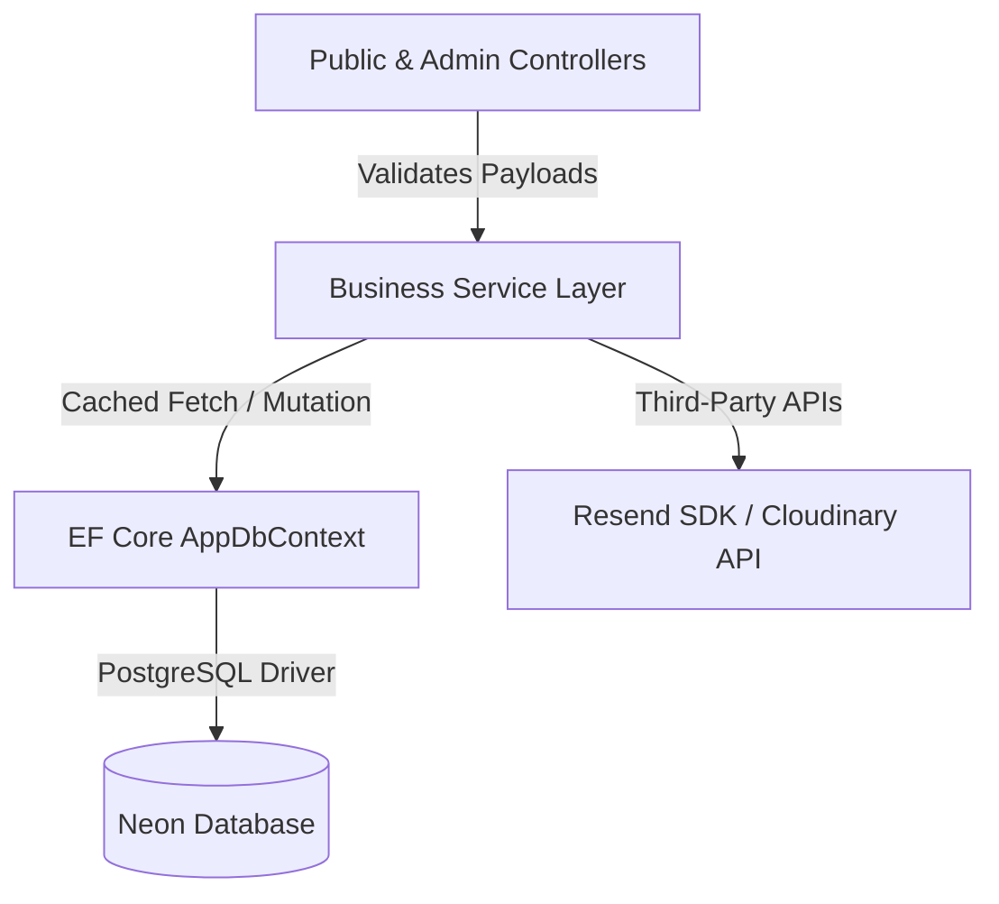

# Backend Logic & Separation of Concerns

This document details the backend architectural design of the **Truyền Thuyết Champong** application, focusing on layer separation, cached service patterns, and validation gateways.

---

## 1. Separation of Concerns (Layered Design)

The application separates execution into three primary layers to guarantee testability, maintainability, and clean boundaries:



### Layer Responsibilities

1.  **Presentation / Routing Layer (Controllers)**:
    *   Expose endpoints for public clients and administrative screens.
    *   Coordinate requests, validate binding models, and manage UI redirection.
    *   Write session updates to cookies and notification states to `TempData`.
    *   *Constraint*: Controllers must never write raw SQL queries, direct EF Linq context filters, or execute external API calls directly.
2.  **Service Layer (Business Logic)**:
    *   Act as the exclusive source of business calculations, validation rules, formatting, and operations.
    *   Integrate external dependencies (e.g. Resend SDK inside `EmailService`, Cloudinary storage client inside `ImageStorageService`).
    *   Handle memory cache configurations to optimize query times.
3.  **Data Access Layer (EF Core & PostgreSQL)**:
    *   Provide relational persistence via `AppDbContext`.
    *   Track modifications and write transactions to the PostgreSQL server.

---

## 2. Validation Gateways via ModelState

Before a request propagates to the business service tier, the controller checks the structural integrity of the input data using `ModelState`.

### Gatekeeper Pattern
By using MVC Model Binding, incoming HTTP request payloads are automatically parsed and matched against validation schemas. The controller evaluates `ModelState.IsValid` as a strict gatekeeper:

```csharp
[HttpPost]
[ValidateAntiForgeryToken]
public async Task<IActionResult> Create(ReservationCreateRequest request)
{
    // 1. Check schema validity immediately
    if (!ModelState.IsValid)
    {
        // Retain form input and render validation messages
        var viewModel = await PopulateFormStateAsync(request);
        return View(viewModel);
    }

    // 2. Delegate valid request payload to business service
    var result = await _reservationService.CreateReservationAsync(request);
    if (!result.IsSuccess)
    {
        ModelState.AddModelError(string.Empty, result.ErrorMessage ?? "Đặt bàn thất bại.");
        var viewModel = await PopulateFormStateAsync(request);
        return View(viewModel);
    }

    // 3. Return success routing state
    return RedirectToAction(nameof(Success), new { code = result.Code });
}
```

### Benefits of the Validation Block
*   **Database Guard**: Blocks malformed, incomplete, or corrupted records from ever reaching PostgreSQL.
*   **Resource Protection**: Prevents resource-intensive database queries or third-party email API calls on inputs that are fundamentally flawed.
*   **Consistent Client Feedback**: Generates predictable error feedback using standard Razor helper tags `<span asp-validation-for="...">`.

---

## 3. Cached Service Implementations

To enhance response times and minimize database workloads, key services utilize Microsoft's `IMemoryCache` to buffer static or slow-changing configurations.

### 1. Active Branch Caching ([BranchService](file:///f:/Coding/Web%20development/KIG%20Holding/KIGHolding/Services/BranchService.cs))
*   **Key**: `branches:active`
*   **Duration**: 10 minutes absolute expiration.
*   **Query Performance**: Fetches branch lists with `.AsNoTracking()` to avoid Entity Framework change-tracker overhead.

```csharp
public async Task<IReadOnlyList<Branch>> GetActiveBranchesAsync(CancellationToken cancellationToken = default)
{
    return await _cache.GetOrCreateAsync(ActiveBranchesCacheKey, async entry =>
    {
        entry.AbsoluteExpirationRelativeToNow = TimeSpan.FromMinutes(10);
        return await _dbContext.Branches
            .AsNoTracking()
            .Where(x => x.IsActive)
            .OrderBy(x => x.DisplayOrder)
            .ToListAsync(cancellationToken);
    }) ?? [];
}
```

### 2. Website Configurations Caching ([SiteSettingService](file:///f:/Coding/Web%20development/KIG%20Holding/KIGHolding/Services/SiteSettingService.cs))
*   **Key**: `settings:global`
*   **Duration**: Cached indefinitely or until modifications are pushed.
*   **Context**: Prevents loading key-value site configurations (hotline numbers, social links, footer notes) on every single page render.

### 3. News Feed Aggregations ([NewsService](file:///f:/Coding/Web%20development/KIG%20Holding/KIGHolding/Services/NewsService.cs))
*   **Key patterns**: `news:categories:active` and list filters.
*   **Duration**: 5 minutes sliding expiration.

---

## 4. Cache Invalidation Patterns

To prevent administrators from seeing outdated dashboard info after saving updates, services must expose cache invalidation routines.

### Manual Cache Clears
When write commands occur inside the Admin area, the respective service clears the cache keys immediately.

```csharp
// Inside BranchController.cs after successful Create or Update:
_branchService.InvalidateActiveBranchesCache();
```

Inside `BranchService.cs`, this triggers a clean-up:
```csharp
public void InvalidateActiveBranchesCache()
{
    _cache.Remove("branches:active");
}
```

This guarantees that subsequent client requests bypass the cache, query PostgreSQL for fresh records, and re-cache the updated data.
