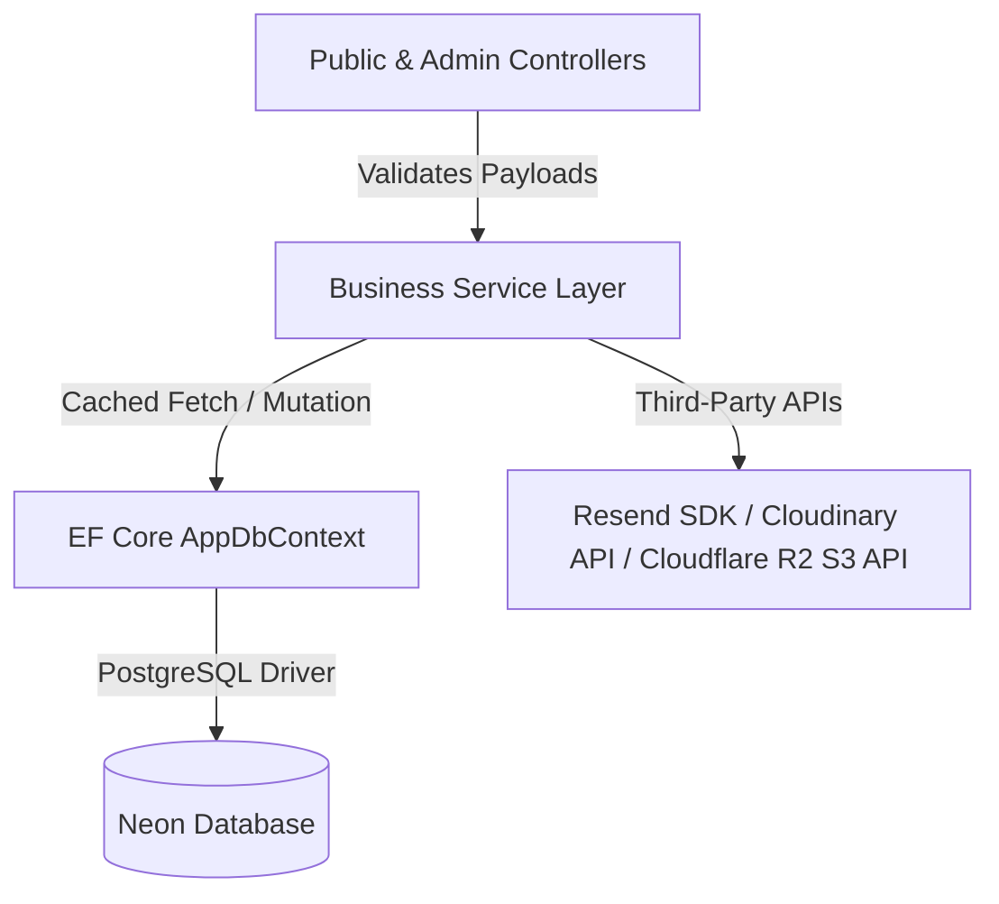

# Backend Logic & Separation of Concerns

This document details the backend architectural design of the **Truyền Thuyết Champong** application, focusing on layer separation, cached service patterns, and validation gateways.

---

## 1. Separation of Concerns (Layered Design)

The application separates execution into three primary layers to guarantee testability, maintainability, and clean boundaries:



### Layer Responsibilities

1.  **Presentation / Routing Layer (Controllers)**:
    *   Expose endpoints for public clients and administrative screens.
    *   Coordinate requests, validate binding models, and manage UI redirection.
    *   Write session updates to cookies and notification states to `TempData`.
    *   *Constraint*: Controllers must never write raw SQL queries, direct EF Linq context filters, or execute external API calls directly.
2.  **Service Layer (Business Logic)**:
    *   Act as the exclusive source of business calculations, validation rules, formatting, and operations.
    *   Integrate external dependencies (e.g. Resend SDK inside `EmailService`, image-storage providers behind `IImageStorageService`).
    *   Handle memory cache configurations to optimize query times.
3.  **Data Access Layer (EF Core & PostgreSQL)**:
    *   Provide relational persistence via `AppDbContext`.
    *   Track modifications and write transactions to the PostgreSQL server.

---

## 2. Validation Gateways via ModelState

Before a request propagates to the business service tier, the controller checks the structural integrity of the input data using `ModelState`.

### Gatekeeper Pattern
By using MVC Model Binding, incoming HTTP request payloads are automatically parsed and matched against validation schemas. The controller evaluates `ModelState.IsValid` as a strict gatekeeper:

```csharp
[HttpPost]
[ValidateAntiForgeryToken]
public async Task<IActionResult> Create(ReservationCreateRequest request)
{
    // 1. Check schema validity immediately
    if (!ModelState.IsValid)
    {
        // Retain form input and render validation messages
        var viewModel = await PopulateFormStateAsync(request);
        return View(viewModel);
    }

    // 2. Delegate valid request payload to business service
    var result = await _reservationService.CreateReservationAsync(request);
    if (!result.IsSuccess)
    {
        ModelState.AddModelError(string.Empty, result.ErrorMessage ?? "Đặt bàn thất bại.");
        var viewModel = await PopulateFormStateAsync(request);
        return View(viewModel);
    }

    // 3. Return success routing state
    return RedirectToAction(nameof(Success), new { code = result.Code });
}
```

### Benefits of the Validation Block
*   **Database Guard**: Blocks malformed, incomplete, or corrupted records from ever reaching PostgreSQL.
*   **Resource Protection**: Prevents resource-intensive database queries or third-party email API calls on inputs that are fundamentally flawed.
*   **Consistent Client Feedback**: Generates predictable error feedback using standard Razor helper tags `<span asp-validation-for="...">`.

### Multi-Tier Server-Side Validation Chain
Once a request passes the initial `ModelState` gateway, the business service layer ([ReservationService.cs](file:///f:/Coding/Web%20development/KIG%20Holding/KIGHolding/Services/ReservationService.cs)) processes it through a strict sequential validation pipeline:
1. **Authoritative Date Policy**: Calls `VietnamHolidayEvaluator.EvaluateReservationDate(request.ReservationDate, VietnamHolidayEvaluator.GetVietnamToday(timeProvider))` before branch database lookup or persistence. Precedence is `PastDate`, `BookingCalendarClosed`, `Weekend`, `Holiday`, then `Allowed`.
2. **In-Memory Rate Limiting Gate**: Checks the memory cache for active locks on the normalized phone number to block spam submissions within a 10-minute window.
3. **Database Parameter Validation**: Assures validity of branch IDs, capacity bounds, and session slots prior to storage execution.
4. **Transaction & Persistence**: Opens the transaction, takes the advisory lock, creates the `Reservation`, saves, commits, stamps the rate-limit success key, and publishes post-commit notifications only after all validation succeeds.

The date policy is centralized under [VietnamHolidayEvaluator.cs](file:///f:/Coding/Web%20development/KIG%20Holding/KIGHolding/Services/VietnamHolidayEvaluator.cs). The submitted `DateOnly` is evaluated directly and, when allowed, stored unchanged. Frontend date restrictions mirror this policy for user experience only; the service layer remains authoritative if client-side checks are bypassed.

Configured holiday data currently exists for 2026, 2027, and 2028. The authoritative open booking calendar ends at `VietnamHolidayEvaluator.MaximumOpenReservationDate`, currently `2028-12-31` inclusive. Dates after that maximum return `BookingCalendarClosed`; 2029 is not open until an owner-approved Vietnamese public/lunar/compensatory holiday list is supplied and the configured coverage boundary is extended.

Rejected date-policy requests return before branch database lookup, branch-hours validation, transaction begin, advisory lock, `Reservations.Add`, `SaveChangesAsync`, rate-limit success stamping, SignalR notification, and controller-owned email dispatch.

`VietnamHolidayEvaluator` is the only authoritative holiday-date collection. Obsolete independently configured reservation special-date lists must not be reintroduced.

---

## 3. Cached Service Implementations

To enhance response times and minimize database workloads, key services utilize Microsoft's `IMemoryCache` to buffer static or slow-changing configurations.

### 1. Active Branch Caching ([BranchService](file:///f:/Coding/Web%20development/KIG%20Holding/KIGHolding/Services/BranchService.cs))
*   **Key**: `branches:active`
*   **Duration**: 10 minutes absolute expiration.
*   **Query Performance**: Fetches branch lists with `.AsNoTracking()` to avoid Entity Framework change-tracker overhead.

```csharp
public async Task<IReadOnlyList<Branch>> GetActiveBranchesAsync(CancellationToken cancellationToken = default)
{
    return await _cache.GetOrCreateAsync(ActiveBranchesCacheKey, async entry =>
    {
        entry.AbsoluteExpirationRelativeToNow = TimeSpan.FromMinutes(10);
        return await _dbContext.Branches
            .AsNoTracking()
            .Where(x => x.IsActive)
            .OrderBy(x => x.DisplayOrder)
            .ToListAsync(cancellationToken);
    }) ?? [];
}
```

### 2. Website Configurations Caching ([SiteSettingService](file:///f:/Coding/Web%20development/KIG%20Holding/KIGHolding/Services/SiteSettingService.cs))
*   **Key**: `settings:global`
*   **Duration**: Cached indefinitely or until modifications are pushed.
*   **Context**: Prevents loading key-value site configurations (hotline numbers, social links, footer notes) on every single page render.

### 3. News Feed Aggregations ([NewsService](file:///f:/Coding/Web%20development/KIG%20Holding/KIGHolding/Services/NewsService.cs))
*   **Key patterns**: `news:categories:active` and list filters.
*   **Duration**: 5 minutes sliding expiration.

### 4. Reservation Rate Limiting ([ReservationService](file:///f:/Coding/Web%20development/KIG%20Holding/KIGHolding/Services/ReservationService.cs))
*   **Key Pattern**: `res_lock:phone:{NormalizedPhone}` where `{NormalizedPhone}` is normalized by [IdentityNormalizer.cs](file:///f:/Coding/Web%20development/KIG%20Holding/KIGHolding/Services/IdentityNormalizer.cs).
*   **Duration**: 10 minutes absolute expiration.
*   **Memory Defense**: Configured via `options.SizeLimit = 50_000` in `Program.cs` to prevent memory exhaustion, with each cache lock entry registered with a size of `1`.

---

## 4. Cache Invalidation Patterns

To prevent administrators from seeing outdated dashboard info after saving updates, services must expose cache invalidation routines.

### Manual Cache Clears
When write commands occur inside the Admin area, the respective service clears the cache keys immediately.

```csharp
// Inside BranchController.cs after successful Create or Update:
_branchService.InvalidateActiveBranchesCache();
```

Inside `BranchService.cs`, this triggers a clean-up:
```csharp
public void InvalidateActiveBranchesCache()
{
    _cache.Remove("branches:active");
}
```

This guarantees that subsequent client requests bypass the cache, query PostgreSQL for fresh records, and re-cache the updated data.

---

## 5. PostgreSQL Advisory Lock Concurrency Control

To prevent race conditions where a client submits multiple overlapping reservations simultaneously at the exact same millisecond, the application employs a transaction-bound, write-exclusive locking mechanism:

### Advisory Locking Workflow
1. **Active Transaction Begin**: A database transaction is opened with an isolation level of `ReadCommitted`.
2. **Transaction-Scope Lock Acquisition**: The service executes a raw SQL command:
   ```sql
   SELECT pg_advisory_xact_lock(hashtext(@NormalizedPhone))
   ```
   This locks a virtual resource identifier derived from the hash of the normalized phone number.
3. **Serialized Evaluation**: If another request for the same phone number attempts to run concurrently, it is blocked at the database level and must wait until the current transaction commits or rolls back.
4. **Safe Verification**: Inside the locked window, the service executes `AnyAsync` checks to ensure the database doesn't already contain a reservation for the client on that day.
5. **Commit and Auto-Release**: On transaction completion, PostgreSQL automatically releases the advisory lock, ensuring zero residual locking overhead on the server.

---

## 5.1 Post-Commit Admin Reservation Notifications

Public website reservations publish the `AdminReservationCreated` SignalR event only after `ReservationService.CreateReservationAsync` has completed `SaveChangesAsync`, committed the PostgreSQL transaction, and stamped the in-memory rate-limit key. The notification is sent through `IAdminReservationNotifier`, not by using `IHubContext` directly from the reservation service or a controller.

Notification publishing is best-effort and independent from email dispatch. If SignalR publishing fails, the service logs the reservation ID and exception, keeps the committed reservation successful, and returns the existing success result so the public controller can continue the existing best-effort email workflow. The reservation database remains the source of truth; missed real-time events are recovered operationally through the Admin reservation list and pending dashboard count.

The server does not persist notification history or guarantee durable delivery in Phase 1. The Admin browser client handles transient disconnects with SignalR automatic reconnect plus a guarded manual restart after terminal close; if no Admin page is connected, the committed reservation remains visible through the normal Admin reservation views.

---

## 6. Image Storage Provider Flow

Admin image uploads must enter through `IImageStorageService`; controllers do not know Cloudinary, LocalVolume, AWS SDK, or Cloudflare-specific types.

```text
Admin form upload
-> controller validation
-> IImageStorageService
-> active IImageStorageProvider
-> physical LocalVolume path or Cloudflare R2 object key
-> returned public URL/path stored on the entity
-> Razor renders the stored URL/path directly
```

`ImageStorage:Provider` is parsed centrally and supports `LocalVolume`, `Cloudinary`, and `CloudflareR2`. New R2 uploads return absolute public URLs. Delete routing is based on the stored reference, not only on the current active upload provider:

* `/uploads/...` remains LocalVolume-compatible.
* Recognized Cloudinary URLs remain Cloudinary-compatible.
* Configured R2 public URLs or safe R2 object keys are deleted only when they are under the expected category prefix.
* External unmanaged URLs and static assets are ignored.

Menu page uploads add one scoped storage segment from the persisted `MenuGroup.Slug`:

```text
MenuGroup.Slug
-> validated single path segment
-> IImageStorageService.UploadAsync(file, ImageCategory.MenuPages, slug)
-> menu-pages/<slug>/<safe-unique-filename>
```

Invalid persisted slugs stop the upload before any object is written or `MenuPageImage` row is saved. Existing root-level `menu-pages/<filename>` objects remain supported for deletes, and slug renames do not move previously uploaded objects.

Upload size uses `ImageStorage:MaxFileSizeBytes` as the canonical storage-service limit. The current value is 50 MB. Kestrel and multipart transport limits remain 60 MB to allow form-data overhead. Feature-specific controller checks may be stricter: branch thumbnails are 2 MB, menu group covers are 10 MB, menu pages are 50 MB, and post thumbnails are 2 MB.
