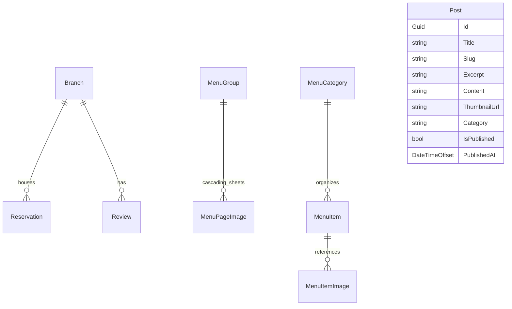

# Backend Project Context — KIGHolding / Truyền Thuyết Champong

## 1. Purpose of This Document
This document serves as a high-fidelity backend architecture checkpoint and handoff file for the **KIGHolding / Truyền Thuyết Champong** website (an ASP.NET Core 10.0 MVC + Entity Framework Core + PostgreSQL application). It maps the backend system design, database configurations, business logic services, routing maps, secure admin boundaries, file uploads, critical safety patterns, and known risks.

By studying this file, future developers or AI coding assistants can immediately comprehend the backend's full capabilities and constraints without reading long historical threads or executing recursive repository file audits.

---

## 2. Backend Architecture Overview
* **Framework**: ASP.NET Core 10.0 (MVC architecture style).
* **Programming Language**: C# 13.
* **Database**: PostgreSQL (connected via Npgsql Provider for EF Core).
* **Architecture Style**: Traditional MVC with thin, dedicated Business Services layers mapping directly to dynamic database providers. 
* **Admin/Public Boundary Split**:
  * **Public Boundary**: Handles sitemaps, homepage view-aggregations, case/diacritic-insensitive branch searches, category-filtered news flows, reservations, and group brand menu viewers.
  * **Admin Boundary (`/Admin/*`)**: Provides robust CRUD capabilities for managing branches, news posts, settings, review listings, menu groups, category structures, menu items, and reservation operations. Securely locked down by Cookie Authentication and Anti-Forgery tokens.

---

## 3. Runtime, Dependency Injection, and Routing Setup
Managed in the unified `Program.cs` startup file:

### Core Service Registrations (Dependency Injection)
* **Identity & Authentication**: Registered cookie scheme (`KIGHolding.AdminAuth`) redirecting login, logout, and access-denial hooks to `/Admin/Auth/Login` with sliding expiration (8-hour expire timespan).
* **Data Protection System**: Keys are persisted under `/App_Data/DataProtectionKeys/` and configured under the application name `"KIGHolding.Web"`.
* **Database Context**: Registered `AppDbContext` utilizing PostgreSQL connection strings loaded from `appsettings.json`.
* **Business Services Mapping**:
  * `DbInitializer` -> Handles database seeding and initial SuperAdmin creations.
  * `ISiteSettingService` -> `SiteSettingService` (website name, slogan, emails, hotlines, logos).
  * `IMenuService` -> `MenuService` (old item-centric catalog logic).
  * `IMenuGroupService` -> `MenuGroupService` (new group brand and menu sheet viewer).
  * `IBranchService` -> `BranchService` (branch details, hotline, maps).
  * `INewsService` -> `NewsService` (editorial news list, pages, categories).
  * `IReservationService` -> `ReservationService` (active branch booking slot queries).
  * `IContactService` -> `ContactService` (mailbox messages, contact details).

### System Middlewares & Optimization
* **Logging Providers**: Console and Debug logging outputs are explicitly active.
* **Response Compression**: Active over HTTPS, compressing SVGs, XML documents, and plain sitemaps dynamically.
* **Status Pages**: Intercepts error response codes and performs a secure internal re-execute to `/error/{statusCode}` (e.g. NotFound, SystemError).

---

## 4. Database and EF Core Context
* **Database Context File**: `Data/AppDbContext.cs`.
* **Database Provider**: PostgreSQL via Npgsql.
* **Timestamp Lifecycle Automation (`UpdateTimestamps()`)**:
  * AppDbContext implements custom intercepts during `SaveChanges` and `SaveChangesAsync`.
  * Entities implementing `ICreatedAtEntity` automatically have their `CreatedAt` field set to `DateTimeOffset.UtcNow` on insert, and locks the field from modifications during updates.
  * Entities implementing `IUpdatedAtEntity` have their `UpdatedAt` field updated to `DateTimeOffset.UtcNow` on both insert and modified states.
* **Active Migration History**:
  1. `20260508045623_FirstDBMigration.cs` -> Installs basic settings, category, item, branch, reservation, news, and review schemas.
  2. `20260508052050_AddAdminUserTable.cs` -> Deploys the secure AdminUser authentication table.
  3. `20260525103020_AddMenuGroupsAndMenuPageImages.cs` -> Deploys the new brand catalog MenuGroup tables and cascading MenuPageImage sheets.

---

## 5. Entity Model Overview
The system tracks business requirements across the following Entity models:



* **AdminUser**: Stores super-administrator credentials (`Username`, `PasswordHash`, `Email`, `DisplayName`, and timestamps).
* **SiteSetting**: Singlet configuration record storing the global variables of the brand (`BrandName`, `Slogan`, `Hotline`, `Email`, `Address`, `LogoUrl`, `FacebookUrl`, `ZaloUrl`, `TiktokUrl`, `CompanyLegalName`, `BusinessRegistrationNumber`, etc.).
* **Post**: Editorial updates containing SEO properties, drafts status (`IsPublished`), category tags (`Category`), and dates.
* **Branch**: Represents physical restaurants. Stores addresses, hotline links, exact area dropdown coordinates, active hours (`OpeningTime` / `ClosingTime` typed as `TimeOnly`), capacities, square meters, Google Maps iframe links, and fallback thumbnails.
* **Reservation**: Stores user bookings. Holds customer names, phone numbers, guest counts, reservation dates/times (`DateOnly` and `TimeOnly`), notes, booking source (Website/Manual), status enums (Pending, Confirmed, Cancelled), and links to a parent `Branch`.
* **Review**: Guest testimonial reviews. Stores author names, scores, comments, visibility, and links to branches.
* **ContactMessage**: Inbox emails sent via public contacts. Tracks names, emails, subjects, content, subjects, status enums (New, Read, Replied), and timestamps.
* **MenuCategory / MenuItem / MenuItemImage**: Legacy item-centric catalog tracking categories (BBQ, Champong, Combos), individual dishes (Korean Name, Description, Price, original crossed price, Spiciness scale 1-5, kcal count, Signature/Bestseller flags), and detail thumbnail lists.
* **MenuGroup / MenuPageImage**: New brand catalog. Renders groups (e.g. Gogimaru, KBB Cook) carrying descriptive summaries, cover pages, and lists of uploaded menu pages.
* **MediaAsset**: Basic utility files track table. Records physical paths, filenames, content types, sizes, and references.

---

## 6. DateTimeOffset and PostgreSQL UTC Rules
> [!CRITICAL]
> **POSTGRESQL TIMESTAMPTZ REQUIREMENT**
> Npgsql and PostgreSQL `timestamp with time zone` (timestamptz) columns strictly require dates to have an offset of 0 (UTC). Saving a `DateTimeOffset` with a local offset (such as `+07:00` for Vietnam time) will cause Entity Framework or Npgsql driver crash errors during serialization.

### The UTC Fix Strategy
All date writes and updates **must** use `DateTimeOffset.UtcNow` or invoke `.ToUniversalTime()` before committing.
* **Timestamp Lifecycle Hook**: Automated inside `AppDbContext.UpdateTimestamps` setting fields to `DateTimeOffset.UtcNow`.
* **Admin Form Input Fix (`PostController.cs` L326-343)**: Forms capture local times (typed as `DateTime?` or `DateTime`). They are normalized securely using:
  ```csharp
  private static DateTimeOffset NormalizeLocalInputToUtc(DateTime value)
  {
      if (value.Kind == DateTimeKind.Utc)
      {
          return new DateTimeOffset(value, TimeSpan.Zero);
      }
      var localValue = value.Kind == DateTimeKind.Unspecified
          ? DateTime.SpecifyKind(value, DateTimeKind.Local)
          : value;
      return new DateTimeOffset(localValue).ToUniversalTime();
  }
  ```

---

## 7. News Backend Context
* **Storage Model**: Mapped in the `Posts` DB Table.
* **Static Category System (`Models/Content/NewsCategories.cs`)**:
  To keep database queries clean and maintain absolute integrity, news categories are structured as a robust, static enumeration record system rather than a dynamic database table:
  1. `nhuong-quyen-hop-tac` -> "Nhượng quyền – Hợp tác"
  2. `he-thong-chi-nhanh` -> "Hệ thống chi nhánh"
  3. `su-kien-hoat-dong` -> "Sự kiện và Hoạt động"
  4. `khuyen-mai-uu-dai` -> "Khuyến mãi và Ưu đãi"
  5. `menu-mon-moi` -> "Menu và Món mới"
  6. `tin-tuc-thong-bao` -> "Tin tức và Thông báo" (Default category)
* **Categories Normalization**: The class `NewsCategories` slugifies strings, registers alias arrays, and resolves category queries dynamically (e.g., matching `"Món mới"` or `"Tin tức"` to their database keys).
* **News Service / Controller Logic**:
  * GET `/tin-tuc` (`Index` action) compiles paginated lists (default 9 items/page), pulling details via `INewsService.GetPublishedPostsPageAsync(...)`.
  * GET `/tin-tuc/{slug}` (`Detail` action) fetches drafts or published posts. Related articles query uses `INewsService.GetRelatedPostsAsync(...)` pulling similar categories; if fewer than 3 related items are found, it falls back to a list of latest items.
  * Admin Post CRUD manages thumbnail file uploads, validates category keys, and forces offsets to UTC before calling `SaveChangesAsync`.

---

## 8. Menu Backend Context
The project successfully coexists two distinct catalog systems:

### 1. Legacy Item-Centric System
* **Models**: `MenuCategory`, `MenuItem`, `MenuItemImage`.
* **Public Route**: `/thuc-don/{menuItemSlug}` (Detail view of single dishes, spiciness levels, calories).
* **Status**: Retained and preserved to protect existing SEO traffic and deep links. Admin panel CRUD views are fully kept intact under `/Admin/MenuCategory` and `/Admin/MenuItem`.

### 2. Modern Group-Centric System (The Flipbook Brand Catalog)
* **Models**: `MenuGroup`, `MenuPageImage`.
* **Public Landing (Hub)**: GET `/thuc-don` (Loads all published menu groups carrying page image counts).
* **Public Detailed Viewer**: GET `/thuc-don/nhom/{slug}` (Renders the group detail layout and loads all cascading page sheets).
* **Flipbook Engine API Flow**:
  * Dual-view mode (Book/Scroll) is parsed in `menu-flipbook.js` by scraping DOM images populated via `MenuController.Group`.
  * Empty alt texts are resolved on uploader save using fallback strings (`"{GroupName} - Trang thực đơn {PageNumber}"`).
  * If a menu group is saved without cover media, it dynamically uses the first uploaded menu sheet image as cover.
* **Upload Path**: Files are uploaded and managed via secure POST controllers, saving objects physically to `wwwroot/uploads/menu-pages/`.

---

## 9. Branch Backend Context
* **Storage Model**: Mapped in `Branches` table. Holds fields for time constraints (`OpeningTime` / `ClosingTime` mapped as `TimeOnly` values).
* **GET Search Logic**: Case and diacritic-insensitive matching. Diacritics are removed using Unicode normalization (`NormalizationForm.FormD`) filtering out non-spacing characters before comparing strings in C#.
* **Autocomplete suggestions**: Suggested text values are serialized via JSON directly into the DOM (`data-branch-suggestion-data`) during page render, enabling lightweight suggesters on client search without polling database queries.
* **Booking Integration**: branch cards link directly to reservation controllers `/dat-ban?branch=slug`, prepopulating dropdown forms on landing.

---

## 10. Reservation Backend Context
* **Storage Model**: Mapped in the `Reservations` DB Table. Holds `DateOnly` and `TimeOnly` properties.
* **Business Validation Rules**:
  * Date must not be in the past.
  * Guest count must be between 1 and 100.
  * Branch ID must be active (`IsActive == true`).
  * Time must sit within the opening/closing times of the target branch (`IsWithinOpeningHours`).
* **Planned / Discussed Rules (Not currently hardcoded in EF core layer)**:
  * Restricting booking slot hours strictly to `10:40 – 21:30`.
  * Restricting afternoon breaks `14:00 - 16:00` on specific locations.
  * Enforcing 2+ guest rules except on special holiday exemptions.
  * *Note: These remain as discussed roadmap rules. If implemented in the future, they should be added inside `ReservationService.CreateReservationAsync` as new validation models.*

---

## 11. Contact / Member / Franchise Backend Context
* **Contact Box**: Public POST routes to `/lien-he` save messages directly to `ContactMessages` table with a default `New` status.
* **Admin Contact CRUD**: Admins read details, toggle read status, and delete messages.
* **Member / Franchise routes**:
  * `/thanh-vien` maps to placeholder screens.
  * `/lien-he-nhuong-quyen` maps to placeholder screens.
  * Backend routing is fully mapped in controllers to allow quick database mapping during future expansion phases.

---

## 12. Admin Backend Context
* **Base Controller**: All admin views derive from `AdminBaseController`.
* **Area Name**: `"Admin"`.
* **Security lock**: Global Class decoration with `[Authorize]`.
* **Auto-Message TempData system**:
  * `AdminBaseController` intercepts actions globally in `OnActionExecuted`.
  * If a POST request returns a redirect result (indicating successful operations), it automatically injects a `SuccessMessage` into the temp dataset.
  * If a POST request returns a ViewResult (indicating validation failure/errors), it injects a generic `ErrorMessage` alerting the admin.
* **Anti-Forgery**: Mandatory `[ValidateAntiForgeryToken]` decoration on all HttpPost routes within the admin panel.

---

## 13. Upload and File Handling Context
Upload mechanics are handled natively inside controllers (e.g., `PostController`, `MenuGroupController`, `MenuItemController`):

### 1. Hard Constraints and Rules
* **Upload Paths**:
  * News Thumbnails: `wwwroot/uploads/posts/`
  * Branch Thumbnails: `wwwroot/uploads/branches/`
  * Menu Page Sheets: `wwwroot/uploads/menu-pages/`
* **Allowed Extensions**: `.jpg`, `.jpeg`, `.png`, `.webp`.
* **Allowed Content Types**: `image/jpeg`, `image/png`, `image/webp`.
* **Max Sizes**: 
  * News posts / branch thumbnails: **2MB** (`MaxFileSize`).
  * Menu page sheets: **5MB** (`MaxMenuPageFileSize`).

### 2. Filename Strategy
To prevent physical folder collisions, uploaded filenames are converted to slugs, appended with a clean GUID suffix, and combined with the original extension:
```csharp
private static string CreateSafeFileName(string originalFileName, string fallbackBaseName, string extension)
{
    var safeBaseName = NormalizeSlugInput(Path.GetFileNameWithoutExtension(originalFileName));
    if (string.IsNullOrWhiteSpace(safeBaseName))
    {
        safeBaseName = fallbackBaseName;
    }
    return $"{safeBaseName}-{Guid.NewGuid():N}{extension}";
}
```

### 3. File Deletion Security
Physical file cleanups on deletion check the base folder paths strictly to prevent directory traversal exploits (`..\..\..`):
```csharp
private void TryDeleteMenuPageImageFile(string? relativePath)
{
    if (string.IsNullOrWhiteSpace(relativePath) ||
        !relativePath.StartsWith("/uploads/menu-pages/", StringComparison.OrdinalIgnoreCase))
    {
        return;
    }
    var trimmedPath = relativePath.TrimStart('/').Replace('/', Path.DirectorySeparatorChar);
    var fullPath = Path.GetFullPath(Path.Combine(_env.WebRootPath, trimmedPath));
    var uploadsRoot = Path.GetFullPath(Path.Combine(_env.WebRootPath, "uploads", "menu-pages"));

    if (fullPath.StartsWith(uploadsRoot, StringComparison.OrdinalIgnoreCase) && System.IO.File.Exists(fullPath))
    {
        System.IO.File.Delete(fullPath);
    }
}
```

---

## 14. Public and Admin Route Map
The application utilizes clean routing conventions (Attribute-based routing and Area mappings):

### Public Routes
* **Home Page**: GET `/`
* **Menu Landing Hub**: GET `/thuc-don`
* **Menu Group Viewer**: GET `/thuc-don/nhom/{slug}`
* **Preserved Menu Item Detail**: GET `/thuc-don/{slug}` *(Legacy route fallback)*
* **News Listing**: GET `/tin-tuc` (supports query filter `?category=slug&page=1`)
* **News Article Detail**: GET `/tin-tuc/{slug}`
* **Branch Locator**: GET `/chi-nhanh` (supports query filter `?city=value&q=value`)
* **Reservation Booking**: GET & POST `/dat-ban` (pre-select via `?branch=slug`)
* **Contact Box**: GET & POST `/lien-he`
* **SEO Site Map**: GET `/sitemap.xml`
* **SEO Robots**: GET `/robots.txt`

### Admin Boundary Routes (`/Admin/{Controller}/{Action}`)
* **Dashboard**: `/Admin/Dashboard`
* **Post CRUD**: `/Admin/Post`
* **Menu Group Manager**: `/Admin/MenuGroup`
* **Menu Page Upload & Order Manager**: `/Admin/MenuGroup/Images/{id}` *(Custom Upload routes)*
* **Legacy Menu Categories**: `/Admin/MenuCategory`
* **Legacy Menu Items**: `/Admin/MenuItem`
* **Branch CRUD**: `/Admin/Branch`
* **Reservation CRUD**: `/Admin/Reservation`
* **Contact Box crud**: `/Admin/Contact`

---

## 15. SEO and Sitemap Context
* **Controller**: `SeoController.cs` (serving `/sitemap.xml` and `/robots.txt`).
* **Static Routes Included**: All primary static landing URLs.
* **Dynamic Routes Included**:
  * Legacy dynamic items `/thuc-don/{item.Slug}`.
  * Dynamic news articles `/tin-tuc/{post.Slug}`.
* **Sitemap Future Needs (Risk)**:
  * Currently, the sitemap XML does **not** generate routes for the new group viewer (`/thuc-don/nhom/{slug}`). When production content goes live, sitemap generations should be updated to fetch active `MenuGroups` and map their routes dynamically.

---

## 16. Security and Validation Notes
* **Cross-Site Request Forgery (CSRF)**: mandatory `[ValidateAntiForgeryToken]` decoration on all mutating HTTP POST actions.
* **Base Admin Lock**: Locked down globally by standard authorized cookies.
* **Form Validations**: Utilizes standard Data Annotations (`[Required]`, `[StringLength]`) on ViewModels.
* **Path Traversal Shield**: Strictly enforced on file uploader deletions via normalized starts-with checks.
* **HTML Content Safety**: The admin news post uses rich text. Rendering content uses raw Razor tags (`@Html.Raw(paragraph)`). Safeguards must be respected to sanitize rich-text inputs on uploader saves.

---

## 17. Completed Backend Phases
1. **Dynamic Category Engine**: Static Record lookup systems with diacritic-insensitive normalization mapping (Phase A/E/Admin DateTime UTC fix).
2. **Flipbook catalog (Phase B/C/D/F/G)**: Built MenuGroup and MenuPageImage tables, configured cascade deletes, written multi-uploader page-manager screens, and supported Group and Hub routes.
3. **UTC Time Offset Fixes**: Form inputs mapped to local time dates are converted to universal UTC times before writing to PostgreSQL timestamptz columns.
4. **Automated Audits**: AppDbContext tracks ICreatedAtEntity and IUpdatedAtEntity interfaces to apply timestamps automatically.
5. **Seo Sitemap Deploy**: Built robots.txt and sitemap.xml dynamically, pulling dynamic routes from database entities.

---

## 18. Preservation Rules
When working on new phases, you **MUST** strictly adhere to these rules:

* [ ] **Do Not Break Legacy Menu Routes**:
  * Never alter GET `/thuc-don/{slug}` routing rules. Single menu item detail pages are alive and preserved.
  * Keep all supporting structures (`MenuCategory`, `MenuItem`, `MenuItemImage`) intact inside database mappings.
* [ ] **Strict UTC Timestamps**:
  * Never use `DateTimeOffset.Now` or save local offset dates (e.g. `+07:00`).
  * Always normalize dates using `NormalizeLocalInputToUtc` or set to `DateTimeOffset.UtcNow`.
* [ ] **Verify Migration Impacts**:
  * Do not run `database update` or generate EF migrations without explicit scope reviews and backups.
* [ ] **Path Traversal Security**:
  * Maintain starts-with checks inside uploader deletion functions to preserve filesystem integrity.

---

## 19. Known Backend Risks and Technical Debt
* **Coexistence of Catalogs**: The system carries both MenuItem-centric and MenuGroup-centric database entities. The newer flipbook uses MenuGroups, whereas sitemaps and details still carry MenuItem mappings. Maintain both systems safely until a planned deprecation phase is scheduled.
* **Missing MenuGroups in Sitemap**: `SeoController.xml` sitemap does not query `MenuGroups` (`/thuc-don/nhom/{slug}`). Add group listings to the sitemap during the next SEO update phase.
* **Redundant File Upload Logic**: Upload logic is duplicated in both `PostController` and `MenuGroupController`. Refactoring uploader helpers into a single shared service (e.g., `IMediaUploadService`) is recommended to clean up code and prevent duplicate uploader functions.

---

## 20. Future Work Guidance
When starting any new backend phase:
1. **Verify Database Connectivity**:
   * Execute build checks:
     ```powershell
     dotnet build
     ```
2. **Check AppSettings Environment**:
   * Ensure local database seeds and PostgreSQL targets are configured.
3. **Respect UTC Time conversions**:
   * Inspect all modifications to `ReservationDate`, `PublishedAt`, or other date properties to ensure they utilize the correct Universal Time offset.

---

## 21. Quick Start Instructions for a New AI Chat
If you are an AI assistant opening this repository for a new phase or bug-fixing task, follow these guidelines:

1. **Review Local Context First**:
   * Read `docs/backend-project-context.md` (this file) and `docs/frontend-project-context.md` before writing code.
2. **Adhere to Code Safety Constraints**:
   * All saved `DateTimeOffset` must be UTC.
   * Mutating HTTP POST methods must utilize `[ValidateAntiForgeryToken]`.
   * Protect legacy menu item page routes.
3. **Use Scoped Planning**:
   * Formulate a phase-based plan in `implementation_plan.md` first.
   * Once approved, track task checkboxes in `task.md`.
   * Complete the walkthrough in `walkthrough.md` when done.

---

## Quick Prompt for New Chat
Copy and paste the following snippet into the prompt of any new ChatGPT/Codex/Claude conversation:

> “Read `docs/frontend-project-context.md` and `docs/backend-project-context.md` first. Treat them as the absolute source of truth for the current KIGHolding backend architecture, database schemas, active routes, service mappings, file uploader systems, and critical safety rules (including PostgreSQL timestamptz UTC validations). Protect legacy views, follow configuration guidelines, do not change existing routes without migration plans, and continue using phase-based planning.”
