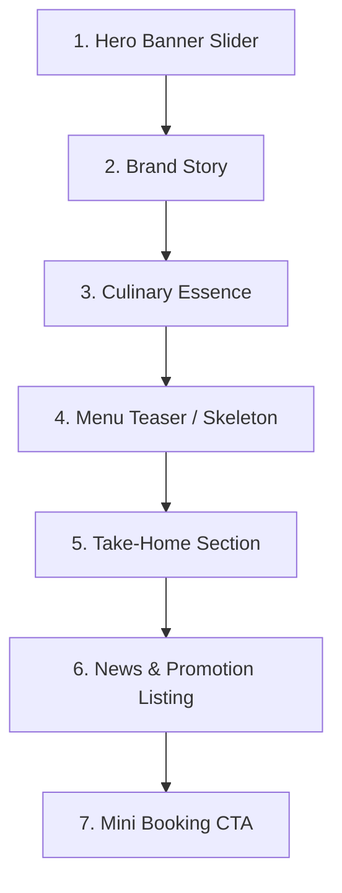

# Frontend Project Context — KIGHolding / Truyền Thuyết Champong

## 1. Purpose of This Document
This document acts as a high-fidelity frontend architecture checkpoint and handoff file for the **KIGHolding / Truyền Thuyết Champong** website (an ASP.NET Core 10.0 MVC + Razor + Tailwind CSS project). It maps the visual identity, completed features, layout states, page-specific conventions, JavaScript engines, asset structures, known risks, and strict preservation rules. 

By reading this file, any subsequent AI coder or developer can immediately understand the current state of the frontend without needing historical chat logs or performing long recursive file audits.

---

## 2. Project Frontend Identity
* **Project Name**: KIGHolding / Truyền Thuyết Champong
* **Public Brand Direction**: A high-end, premium, and sophisticated culinary experience. The brand presents Korean dining (signature Champong seafood noodles, 15-day dry-aged Gogimaru BBQ, KBB Cook table nướng) in an intimate, modern, and high-contrast atmospheric setting.
* **Main Design Language**: **Dark Premium** for public-facing client pages, creating an editorial, upscale restaurant aesthetic.
* **Color/Tone Direction**: Curated dark charcoal gradients, deep black surfaces, delicate light borders, soft golden-cream secondary highlights, and a vibrant **KIG Red** (`#E50914`) brand accent.
* **Admin vs Public Theme Distinction**: 
  * **Public Pages**: Dark premium theme (`bg-brand-black` / `#0B0B0B` base) with red accents.
  * **Admin Boundary**: Stays as a highly readable, clean **Light Theme** (`bg-brand-light` / `#FAF8F3` base, dark text, gray panel borders) with a dark left sidebar for navigation.

---

## 3. Global Design Language
The visual identity of Truyền Thuyết Champong relies on the following design tokens, typography, and visual rules:

* **Typography**: The **Quicksand** sans-serif font family is applied universally via Tailwind config (`font-sans`). It presents rounded, elegant, modern characters suitable for an approachable yet high-end brand.
* **Core Palette (Tailwind Config / CSS Variables)**:
  * **Accent / Brand Red**: `bg-brand-red` / `text-brand-red` (`#E50914`).
  * **Accent Deep**: `bg-brand-redDark` (`#B91C1C`).
  * **Base Dark**: `bg-brand-black` (`#0B0B0B`).
  * **Base Charcoal**: `bg-brand-charcoal` (`#1F2937`).
  * **Base Cream (Public highlights)**: `text-brand-cream` / `text-brand-goldSoft` (`#F9FAFB` / `#E7D9BD`).
  * **Base Light (Admin background)**: `bg-brand-light` (`#FAF8F3`).
  * **Base Gray**: `text-brand-gray` (`#6B7280`).
  * **Base Border**: `border-brand-border` (`#E5E7EB`).
* **Visual Tendencies**:
  * **Gradients**: Soft radial or linear background gradients are used extensively to prevent flat dark sheets (e.g., combining red/charcoal glows with transparent black backdrops).
  * **Cards**: Premium rounded corners (`rounded-[1.4rem]` to `rounded-[2rem]`), thin borders (`border-white/10`), subtle backdrops (`backdrop-blur-[12px]`), and smooth vertical translations on hover (`transition duration-300 hover:-translate-y-1`).
  * **Buttons**: Pill-shaped (`rounded-full`), trackable letter-spacing (`tracking-[0.14em]`), bold uppercase text, and smooth scaling or translation on hover.

---

## 4. Public Layout / Header / Footer
Managed across global views and shared partial components, the layout ensures high performance and responsive adaptability:

### Desktop Navigation & Header (`Partials/_Header.cshtml`)
* **Visuals**: Sticky header (`.site-header`) with a semi-transparent black background (`rgba(11, 11, 11, 0.82)`) and light backdrop-blur, shifting to a solid background upon scrolling (`.is-scrolled`).
* **Structure**: Helper-constructed navigation links using `LayoutFallbacks`. Active pages are marked dynamically through navigation class helpers (`is-active` class showing a sliding red accent line under the link).
* **CTAs**: A prominent, styled red button for **Đặt bàn** (Reservations) sits on the right.
* **KIG Holding Dropdown**: Custom dropdown triggered by hover and `focus-within`. Houses sub-items like "Về KIG Holding" (`/gioi-thieu`), "Thành viên" (`/thanh-vien`), and "Liên hệ" (`/lien-he`). 

### Mobile Drawer Navigation (`Partials/_MobileMenu.cshtml`)
* **Drawer Overlay**: Responsive side drawer (`.mobile-drawer`) sliding from the right (`translate-x-full` to `translate-x-0`).
* **Accordion Menus**: Uses semantic, native HTML `<details>` and `<summary>` elements with styled arrow rotations (`group-open:rotate-180`) to handle nested KIG Holding child links without introducing JS overhead.
* **CTAs**: Block-level red reservation button sits at the footer of the drawer.

### Footer (`Partials/_Footer.cshtml`)
* **Visuals**: Dark charcoal background with soft radial gradients (`rgba(184, 154, 98, 0.12)` top-left glow, `#ffffff` bottom-right tint).
* **Multi-Column Details**:
  * **Brand Column**: Shows the existing high-res transparent logo (`kig-no-bg-logo.png`) or a text mark fallback, legal entity details, and quick direct address map links.
  * **Quick Links**: Exposes dynamic site index navigation.
  * **QR & App Download**: Mockup layout showing download buttons (App Store/Google Play Store placeholders with large character markers) alongside a real webp QR code asset (`kig-holding-qr-app.webp`).
  * **Social Badges**: Round outlined circle buttons representing Facebook, Zalo, and TikTok links.

---

## 5. Home Page Context
The Home Page (`Views/Home/Index.cshtml`) is built using a strict, approved **7-section structure** carrying the premium dark brand layout:



### Section 1: Hero Banner Slider
* **Visuals**: Immersive full-screen height carousel. Uses highly specialized, CSS-drawn glowing circular backdrops (`champong-hero__media::before` conic-gradient) representing heat, steel, and culinary glow, minimizing the need for heavy raw banner assets.
* **Transitions**: Seamless cross-fades between slides, auto-animating every 6.5s. Custom slider controls, dot indicators, and a slide-by-slide progress ticker.
* **JavaScript**: Handled by `home-hero-slider.js`. Pauses on mouseenter/focus, supports keyboard ArrowLeft/ArrowRight, respects system accessibility queries (`prefers-reduced-motion`), and toggles dynamic overlay layers (`is-active`).

### Section 2: Brand Story
* **Visuals**: Premium dual split pane. Left side lists editorial narrative with a grid showing key historical highlights (PMH, 3+ years, Korea, Selection) and clean icons.
* **Assets**: Right column renders the dynamic mockup transparent dish image (`korean-food-no-bg.png`) layered over blur rings and decorative borders.

### Section 3: Culinary Essence
* **Visuals**: High-contrast textured dark banner (`home-culinary-essence`) utilizing overlapping background overlays. Renders the main brands under KIG: **Truyền Thuyết Champong**, **Gogimaru**, and **KBB Cook**.
* **Floating Icons**: Employs absolute-positioned floating illustration elements (Kimchi bowl, Soyu bottle, Spicy noodle bowl, Chilli) that bob and glide on infinite keyframe loops (`homeCulinaryFloatY`, `homeCulinarySlideLeft`, etc.) defined in `input.css`.
* **Layout**: Alternating grid/flex structure (`order-1` / `order-2` flips) showing dish pictures alongside bullet features (spicy noodle tươi, 15-day dry-aged meat, rooftop grill).

### Section 4: Menu Teaser (Skeleton)
* **Visuals**: Elegant text-only skeleton showcase ensuring layout safety without relying on large unverified dish images.
* **Structure**: A featured dish highlight on the left with description and price, paired with a grid of supporting signature items on the right. Exposes direct links to `/thuc-don` with notes preparing it for dynamic PostgreSQL database population.

### Section 5: Take-Home Section ("Mang Champong về nhà")
* **Visuals**: Minimalist split layout presenting home dining convenience.
* **Mockup**: The right column draws a clean CSS composition of a plate/take-out container resting on soft drop shadows ("Đậm vị, gọn gàng, sẵn sàng") to create visual value without external images.

### Section 6: News & Promotions
* **Visuals**: Multi-priority news grid. The first article renders as a massive featured lead card, while the subsequent two articles display as a side column list.
* **Logic**: Exposes category tags, publishing dates, and excerpts. Employs image load error fallbacks.

### Section 7: Booking CTA
* **Visuals**: Simple reservation split pane. 
* **Form**: The right side embeds the global `@await Html.PartialAsync("~/Views/Shared/Components/BookingMiniForm/Default.cshtml", Model.ReservationForm)` partial, keeping reservation logic separate and clean.

---

## 6. Branch Page Context
* **Route**: `/chi-nhanh`
* **Visual Theme**: Fully dark premium layout (`.branch-locator--dark`). Renders branch grids grouped by city (e.g., Hồ Chí Minh, Hà Nội).
* **GET Filter Form**:
  * City filtering through area link tags and dropdown summaries.
  * Diacritic-insensitive and case-insensitive search matching name, address, district, and hotline.
  * Active filter chips and a "Xóa bộ lọc" (Reset filter) link.
* **Branch Cards (`Views/Shared/Components/BranchCard/Default.cshtml`)**:
  * Feature branch thumbnail, city badge, name, capacity indicators, opening time, telephone link, and reservation pre-select URL (`/dat-ban?branch=slug`).
  * Direct map direction link (`target="_blank"` / `rel="noopener"`).
* **Client-Side Suggestions**:
  * Powered by `branch-locator.js` inside `[data-branch-locator]`.
  * Renders autocomplete suggestion lists below the input field on text input (min 2 chars).
  * Supports full keyboard controls (ArrowUp/ArrowDown, Enter to select, Escape to close, click-outside to hide).
* **Map Embed**:
  * Map sits below the results grid, embedded dynamically via a secure Google Maps iframe. If a branch maps URL is not embeddable, it renders an elegant card linking to external map coordinates.

---

## 7. News Frontend Context
* **Routes**: Listing at `/tin-tuc`, detail at `/tin-tuc/{slug}`.
* **Visual Theme**: Dark premium editorial layout (`.news-index--dark` / `.news-detail--dark`).
* **Listing Page**:
  * **Editorial Hierarchy**: Displays up to 5 articles in a visual structure (1 Lead article, 2 Secondary cards, 2 Compact side items) followed by a 3-column grid for standard older posts.
  * **Filters**: Category selection tabs showing active post count indicators.
  * **Pagination**: Outlined page selectors with disabled boundary buttons.
* **Detail Page**:
  * **Visuals**: Structured title panel, reading metadata, and category badges.
  * **Media Frame**: Implements high-aspect media frames with solid CSS-styled fallbacks if the thumbnail image fails to load or is missing.
  * **Article Layout**: Renders clean multi-paragraph narratives (`GetParagraphs` parsing newlines).
  * **Promotions Call**: promotional articles automatically render a prominent bottom CTA banner guiding the reader to book a table immediately.
  * **Related Posts Grid**: Renders a bottom 3-card carousel suggesting similar category updates.

---

## 8. Menu Frontend Context
* **Routes**: Main hub at `/thuc-don`, detailed brand menu view at `/thuc-don/nhom/{slug}`.
* **Preserved Item Route**: Old single-item details still exist at `/thuc-don/{menuItemSlug}` (showing gallery images, spicy level scale dots, khẩu phần size, calories, and a booking trigger banner).
* **Menu Hub (Public Hub)**:
  * Renders active `MenuGroup` blocks (e.g., Truyền Thuyết Champong, Gogimaru) in large alternating split-column cards. Displays cover thumbnails and the count of uploaded menu pages.
* **Group Detailed Viewer**:
  * Fully supports **dual viewing modes**: "Xem dạng cuộn" (Vertical scroll grid) and "Xem dạng sách" (Dual-page Flipbook).
  * On larger screens, it displays a sticky page-navigation sidebar to let users skip directly to any specific page.
* **Flipbook Feature (`menu-flipbook.js`)**:
  * Scrapes menu page image paths directly from the DOM structure.
  * Desktop view renders a gorgeous **two-page spread** with slide/rotation sheet turning animations (`is-turning-next` / `is-turning-prev` transforming `rotateY`).
  * Mobile view automatically locks the mode to a single-page scroll layout for readability.
  * Supports keyboard navigation (ArrowLeft / ArrowRight) and renders beautiful empty placeholders on odd-numbered counts to represent blank back-covers.

---

## 9. Admin Frontend Context
* **Theme**: Strict **Light Theme** (white card backgrounds, `#FAF8F3` light workspace backing, thin slate borders, clean text) to ensure focus, form accuracy, and operational ergonomics.
* **Sidebar**: Remains as a dark sidebar on the left (`bg-brand-black` / `text-white`), using list navigation triggers.
* **Modules Active**: Complete CRUD dashboards are built for MenuGroups, MenuCategories, MenuItems, Branches, Posts, Reviews, Contacts, Site Settings, and Reservations.
* **MenuPageImage Upload Manager (`/Admin/MenuGroup/Images/{id}`)**:
  * Houses the dynamic multi-file image uploader. 
  * Allows operators to drag-and-drop or select multiple menu sheet images (jpg, jpeg, png, webp, max 5MB/file).
  * Lists uploaded sheets in a card grid, allowing administrators to update image `AltText`, `DisplayOrder` (automatically increments by step 10), and public visibility.
  * Tapping delete safely cleans up the PostgreSQL database record and triggers the physical removal of uploader files under `wwwroot/uploads/menu-pages`.

---

## 10. Animation System
The project's animation architecture has completely migrated from old class-based triggers to a robust, high-performance, attribute-driven scroll-reveal system:

* **Obsolete Classes (FORBIDDEN)**: The following classes must **never** be reintroduced in future templates, CSS, or script code:
  * `scroll-reveal`, `reveal-up`, `reveal-left`, `reveal-right`, `delay-100`, `delay-200`, `is-visible`.
* **New Engine (`uw-reveal.js`)**:
  * Utilizes `IntersectionObserver` paired with the standard **Web Animations API** (`Element.prototype.animate`), eliminating CSS animation-fill-mode overhead.
  * **Triggers**: Applied to nodes via the `data-uw-reveal` attribute.
  * **Reveal Types**: Supports `fade-up` (default), `fade-down`, `fade-left`, `fade-right`, `zoom-up`, and `fade-in`.
  * **Customizations**:
    * `data-uw-delay`: Animates after a delay (in milliseconds).
    * `data-uw-duration`: Override transition duration (defaults to 850ms).
    * `data-uw-distance`: Adjust translate offset distance (defaults to 56px).
    * `data-uw-once="true"`: Once triggered, stops observing the element (highly recommended for performance).
  * **Accessibility & Testing**:
    * Respects system media query `prefers-reduced-motion` and falls back immediately to fully revealed states.
    * Supports an override variable in localStorage: `uwRevealMotion`. Setting this to `"force"` forces reveals for testing; setting it to `"off"` turns off animations globally.

---

## 11. CSS and Tailwind Conventions
* **Tailwind File Architecture**:
  * **Canonical Source**: `wwwroot/css/input.css`. All custom component styles, global utility layering, brand animations, and font imports are declared here.
  * **Compiled Target**: `wwwroot/css/site.css` is generated by the Tailwind CSS compiler using PostCSS/minification scripts.
  * **STRICT RULE**: **Never edit `site.css` manually.** Any change made directly to `site.css` will be instantly overwritten during the next asset build phase.
* **Component Layering**: High-use layout blocks are layered under `@layer components` in `input.css` (e.g., `.container-page`, `.site-header`, `.branch-locator--dark`, `.news-card`, `.home-culinary-essence`, `.menu-flipbook__page`).
* **Legacy Gold Remap**:
  * To preserve older Razor files that still use gold styling, legacy variables (like `--color-brand-gold`, `--color-brand-gold-deep`, `--color-brand-gold-soft`) have been temporarily remapped inside `input.css` to point directly to the new premium red/charcoal/cream primary tokens.

---

## 12. JavaScript Conventions
The project embraces a **Progressive Enhancement** approach, keeping JavaScript isolated, lightweight, and page-specific:

* **Site-Wide Script (`site.js`)**: 
  * Keeps a small profile, handling only site-wide layout operations: opening/closing the mobile menu drawer (adding overlays and `overflow-hidden` to body), listening to the Escape key, triggering the smooth `back-to-top` click handler, and performing lightweight client-side card category filters.
* **Page-Specific Scripts**:
  * Heavy UI features (hero banner sliders, branch locator autocompletes, menu flipbooks) are written as isolated vanilla ES5/ES6 scripts (`home-hero-slider.js`, `branch-locator.js`, `menu-flipbook.js`).
  * These scripts check for root elements and **exit silently** (`if (!root) return;`) if loaded on an unrelated page, preventing JavaScript errors from breaking global pages.
  * They are loaded only on their respective Razor templates inside `@section Scripts { ... }` blocks with `asp-append-version="true"`.
* **Reduced Motion**: All custom animation scripts (like the hero slider and menu flipbook) check for `(prefers-reduced-motion: reduce)` to disable transitions or fall back immediately to static layouts.

---

## 13. Assets and Uploads
To prevent broken asset references, the project follows structured image paths and upload directories:

* **Branding & Layout Icons**:
  * Main logos: `wwwroot/images/general/kig-no-bg-logo.png`.
  * QR Code elements: `wwwroot/images/general/kig-holding-qr-app.webp`.
  * Home background texture: `wwwroot/images/home/images/texture.png` and `about-bg.png`.
  * Home Bobbing illustrations: `wwwroot/images/home/images/kimchi-img.png`, `soyu-bottle-img.png`, `spicy-noodle-img.png`, `chilli-img.png`.
  * Culinary icons: `wwwroot/images/home/icons/*.png`.
* **Upload Directories**:
  * Branch uploads: `wwwroot/uploads/branches/`.
  * Menu group uploads: `wwwroot/uploads/menu-groups/`.
  * Menu page uploader: `wwwroot/uploads/menu-pages/`.
* **Dynamic Image Fallback Strategy**:
  * Public components (branch cards, news listing, news detail, menu flipbook) employ a robust HTML fallback inline script:
    ```html
    onerror="this.closest('[data-media-parent]')?.classList.add('is-image-missing'); this.remove();"
    ```
  * If an uploaded media file is missing, the image node is cleanly removed, and the parent container applies an `.is-image-missing` class. This renders a highly polished CSS template fallback containing the branch name, category tags, or a styled icon in the brand color scheme, preventing embarrassing 404 images from staining the premium public UI.

---

## 14. Completed Frontend Phases
1. **Header & Navigation**: Rebuilt with sticky scrolling effects, KIG Holding drop-down menus, responsive mobile drawers, and native accordion accordion toggles.
2. **Footer Layout**: Finalized dark premium multi-column footer displaying branding, map links, QR code mockup apps, and outlined social media buttons.
3. **Home Page Rebuild**: Integrated the custom 7-section carousel slider, brand highlights, dynamic bobbing ingredient showcases, text-only skeleton menus, take-home CTA models, editorial news carousels, and mini-booking panels.
4. **Branch Locator**: Dark premium locator grid with real GET query parameters, grouped cities, Suggester autocompletes, and inline Google Maps integration.
5. **News & Updates Module**: Added editorial priority grids for listing pages, high-contrast news detail reads with auto-booking promos on promotions, and bottom suggestion columns.
6. **Menu Hub & Detail Viewer**: Built large alternating cards on the menu hub and a dual-view menu group viewer supporting full-spread flipbooks and vertical scroll lists.
7. **Admin Uploader & Dashboard Layout**: Kept the light-themed CRUD area clean while adding multi-file uploader grids inside the menu manager.

---

## 15. Preservation Rules
When introducing new views, controllers, or layout updates, you **MUST** strictly respect the following preservation rules:

* [ ] **Protect Separation of Themes**:
  * Keep all public-facing pages in the **Dark Premium** theme with charcoal backgrounds, thin border grids, white text, and red accents.
  * Keep all secure Admin areas in the **Light Theme** (`bg-brand-light`, `#FAF8F3` base, dark charcoal text) to maintain readability and edit accuracy. Do not attempt to dark-theme the admin dashboard.
* [ ] **Do Not Reintroduce Forbidden Reveal Classes**:
  * Never use classes like `scroll-reveal`, `reveal-up`, or `reveal-left`.
  * Use the attribute-driven engine: `data-uw-reveal="fade-up"` (along with optional `data-uw-delay="100"` / `data-uw-once="true"`).
* [ ] **Do Not Manually Edit Generated CSS**:
  * If utility definitions, components, or styles must be modified, make changes ONLY inside `wwwroot/css/input.css` and compile the final file using `npm run build:css`.
* [ ] **Protect Progressive JS Isolation**:
  * Keep vanilla scripts isolated to their pages. Never place page-specific behaviors inside global `site.js`.
  * Always wrap DOM triggers inside a safety exit guard (`if (!root) return;`) and a `DOMContentLoaded` event listener.
* [ ] **Preserve Image Fallback Structures**:
  * When introducing cards or details displaying uploaded user content, always include the `onerror` image removal handler and the corresponding parent CSS fallback layout class.

---

## 16. Known Frontend Risks
* **Obsolete Swiper CDN Load**:
  * `_Layout.cshtml` still includes Swiper JS and CSS CDNs (lines 68, 88). The Home hero has successfully migrated to a high-performance local custom slider (`home-hero-slider.js`). Review if other older sliders or third-party blocks still rely on Swiper before removing these CDN tags to prevent console crashes.
* **Missing Disk Placeholders**:
  * Several older views (e.g., `About/Index.cshtml`, old `Menu/Detail.cshtml`) still reference static placeholder images at `/images/placeholders/*.webp` (like `news-hero.webp`, `food-card.webp`). Verify if these files exist on disk or are handled gracefully by image fallback styles before running a production freeze.
* **Active Gold Highlights in Admin Navigation**:
  * Navigation links inside `_AdminLayout.cshtml` (line 184) still output highlights using legacy variables (`border-brand-gold bg-brand-gold/15 text-brand-goldSoft`). While backward-compatible due to remapped variables in `input.css`, this is a known "gold leak source" to clean up when admin styling is standardized.
* **Filtered Autocomplete Suggestions**:
  * `branch-locator.js` generates suggestions based on the branches currently rendered in the DOM. If a city filter is active, only branches in that city will appear in autocomplete suggestions. Keep this in mind if a global autocomplete dataset is needed later.

---

## 17. Future Work Guidance
When a new developer or AI session is initiated to work on the frontend, they should:

1. **Conduct a Quick Build Verification**:
   * Build the .NET project:
     ```powershell
     dotnet build
     ```
   * Verify that Tailwind CSS builds correctly:
     ```powershell
     npm run build:css
     ```
2. **Align on the Scope of the Current Phase**:
   * Do not touch other completed frontend areas (like the Home Hero or Menu Flipbook) unless explicitly instructed.
   * Work on isolated components or individual page routes.
3. **Run Regression Tests**:
   * After any CSS or markup adjustment, verify public routing states, check for layout leaks, test keyboard/accessibility controls, and check uploader behaviors.

---

## 18. Quick Start Instructions for a New AI Chat
If you are an AI assistant opening this repository for a new phase or feature task, follow these guidelines:

1. **Review Local Context First**:
   * Read `docs/frontend-project-context.md` (this file) and `docs/db-schema.md` or `docs/architecture.md` before writing any code.
2. **Adhere to the Code Guidelines**:
   * Public is Dark Premium, Admin is Light Theme.
   * Universal font family is `Quicksand`.
   * Brand Red accent is `bg-brand-red` (`#E50914`).
   * Avoid gold leaks; do not use old gold/yellow tokens on new sections.
3. **Use Scoped Planning**:
   * Formulate a phase-based plan in `implementation_plan.md` first.
   * Once approved, track task checkboxes in `task.md`.
   * Complete the walkthrough in `walkthrough.md` when done.

---

## Quick Prompt for New Chat
Copy and paste the following snippet into the prompt of any new ChatGPT/Codex/Claude conversation:

> “Read `docs/frontend-project-context.md` first. Treat it as the absolute source of truth for the current KIGHolding public and admin frontend state, visual identity, active layout features, uploader systems, scripting rules, and CSS conventions. Protect completed areas, follow visual guidelines, do not manually edit site.css, and maintain the separation of Dark Premium public pages vs Light Theme admin pages. Continue using phase-based planning.”
