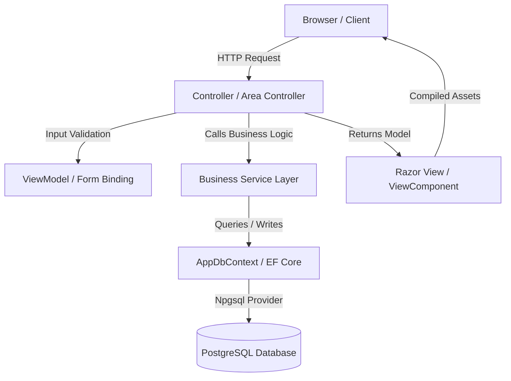

# 02 Architecture Overview

## Layered Architecture Style
The project implements a classic **Layered Model-View-Controller (MVC)** architectural pattern combined with a dedicated **Business Service Layer** and an **Entity Framework Core ORM Data Layer**.

### 1. Controllers to Services Connection
* Controllers (such as [ReservationController](file:///f:/Coding/Web%20development/KIG%20Holding/KIGHolding/Controllers/ReservationController.cs) or [NewsController](file:///f:/Coding/Web%20development/KIG%20Holding/KIGHolding/Controllers/NewsController.cs)) are kept thin. They do not contain core business logic, SQL execution, or database connection handles.
* They receive dependencies in their constructors via .NET Core’s built-in **Constructor Dependency Injection (DI)**.
* Actions handle route parsing, query parameter resolution, model binding, and coordinate service calls. Once a service returns a result, the controller maps it to a ViewModel and returns a View or JSON output.

### 2. Services to DbContext
* Business services (like [ReservationService](file:///f:/Coding/Web%20development/KIG%20Holding/KIGHolding/Services/ReservationService.cs) or [NewsService](file:///f:/Coding/Web%20development/KIG%20Holding/KIGHolding/Services/NewsService.cs)) manage operational business transactions.
* The application **does not use a separate Repository Pattern layer**. Instead, services reference [AppDbContext](file:///f:/Coding/Web%20development/KIG%20Holding/KIGHolding/Data/AppDbContext.cs) directly.
* `AppDbContext` acts as both the Unit of Work and Repository, which simplifies code structure and avoids redundant repository abstractions.

### 3. ViewModels and Data Binding
* Domain Entities (located in `Models/Entities/`) are decoupled from public and admin page rendering.
* Controllers bind requests to dedicated ViewModels (located in `ViewModels/`). This protects database entities from over-posting vulnerabilities and ensures that Razor views only receive data necessary for rendering.
* Shared parts of views, such as headers and footers, populate their layouts using ViewComponents which compile their own specific ViewModels (located in `ViewModels/Shared/`).

### 4. Validation Flow
* Input validation is managed through **Data Annotations** (e.g. `[Required]`, `[StringLength]`, `[Phone]`) decorated on ViewModel properties.
* The ASP.NET Core MVC model binder automatically executes validation before entering action code.
* Controllers check `ModelState.IsValid`. If invalid, they return the form view with error alerts or return a validation payload JSON response (e.g. `ReservationController.Quick` returning a `400 BadRequest` with a dictionary of validation errors).

### 5. Business Rules Location
* Core business rules are contained in the Service layer. For example, [ReservationService.cs](file:///f:/Coding/Web%20development/KIG%20Holding/KIGHolding/Services/ReservationService.cs) validates that reservation dates are not in the past, guest counts are between 1 and 100, and branch IDs represent active locations.
* *Note on Unused Policy Layer*: A second set of complex validation rules (weekday minimum guest counts, afternoon break hours, and localized district blackouts) was designed in [ReservationPolicyService.cs](file:///f:/Coding/Web%20development/KIG%20Holding/KIGHolding/Services/ReservationPolicyService.cs). However, this service is currently **unregistered** in `Program.cs` and bypassed by controllers.

### 6. Frontend and Styling
* Page layouts are structured in Razor Views. Reusable elements (like Cards, Headings, and Headers) are packaged as **ViewComponents** for consistency.
* CSS styling is centralized in [input.css](file:///f:/Coding/Web%20development/KIG%20Holding/KIGHolding/wwwroot/css/input.css) using Tailwind CSS variables and utility classes. Custom page-specific widgets are styled using Tailwind's `@apply` directives inside `@layer components` to avoid inline styling duplication.

---

## Architectural Inconsistencies & Tech Debt

1. **Direct Database Checks in Controllers**: `ReservationController.cs` and `MenuController.cs` contain helper methods (e.g. `HasConfiguredDatabase()`) that inspect the database connection string directly within the controller instead of checking this through a database health service or infrastructure layer.
2. **Policy Service Disconnect**: The presence of two separate reservation validation files (`ReservationService.cs` carrying simple checks, and `ReservationPolicyService.cs` carrying detailed policy options) creates confusion about where booking constraints are defined.
3. **Uploader Duplication**: Rather than implementing an `IImageUploadService` or media helper class, controllers (like `PostController` and `MenuGroupController`) duplicate file extension checks, path validation, and Guid safe-name generation.
