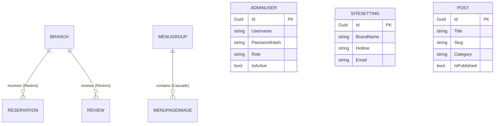

# 06 Database Schema and Entities

## DbContext
* **File Path**: [AppDbContext.cs](file:///f:/Coding/Web%20development/KIG%20Holding/KIGHolding/Data/AppDbContext.cs)
* **Provider**: PostgreSQL via Npgsql.
* **Save Interceptors**: Automatically overrides `SaveChanges` and `SaveChangesAsync` to intercept entities implementing:
  * `ICreatedAtEntity`: Automates setting `CreatedAt` to `DateTimeOffset.UtcNow` on entity inserts and locks it during edits.
  * `IUpdatedAtEntity`: Automates updating `UpdatedAt` to `DateTimeOffset.UtcNow` on entity insertions and modifications.

---

## Entity List

| Entity | DB Table Name | Purpose | Key Fields | Key Relationships |
|--------|---------------|---------|------------|-------------------|
| `AdminUser` | `AdminUsers` | System administrators credentials. | `Id` (Guid PK) | None. |
| `SiteSetting` | `SiteSettings` | Singlet site configuration metrics. | `Id` (Guid PK) | None. |
| `Post` | `Posts` | Editorial blog news updates. | `Id` (Guid PK) | None. |
| `Branch` | `Branches` | Restaurant details. | `Id` (Guid PK) | One-to-many with `Reservations` (Restrict delete). |
| `Reservation` | `Reservations` | Customer table booking logs. | `Id` (Guid PK) | Many-to-one with `Branch`. |
| `Review` | `Reviews` | Customer testimonials. | `Id` (Guid PK) | Many-to-one with `Branch`. |
| `ContactMessage`| `ContactMessages` | Customer request messages. | `Id` (Guid PK) | None. |
| `MenuGroup` | `MenuGroups` | Menu concepts groups. | `Id` (Guid PK) | One-to-many with `MenuPageImages` (Cascade delete). |
| `MenuPageImage` | `MenuPageImages` | Individual menu page image sheets. | `Id` (Guid PK) | Many-to-one with `MenuGroup`. |
| `MediaAsset` | `MediaAssets` | Managed media files index. | `Id` (Guid PK) | None. |

---

## Entity Details

### 1. AdminUser
* **Check Constraints**: None.
* **Indexes**: Unique index on `Username`.
* **Properties**:
  * `Id` (Guid PK)
  * `Username` (string, max 80, required)
  * `PasswordHash` (string, max 500, required)
  * `Email` (string, max 160, required)
  * `DisplayName` (string, max 120, required)
  * `Role` (string, max 50, required, default "SuperAdmin")
  * `IsActive` (bool, default true)
  * `CreatedAt`, `UpdatedAt` (DateTimeOffset, auto-timestamped)

### 2. Branch
* **Check Constraints**:
  * `CK_Branches_Capacity`: `"Capacity" >= 0`
  * `CK_Branches_AreaSquareMeters`: `"AreaSquareMeters" IS NULL OR "AreaSquareMeters" > 0`
  * `CK_Branches_NumberOfFloors`: `"NumberOfFloors" IS NULL OR "NumberOfFloors" > 0`
* **Indexes**: 
  * Unique index on `Slug`.
  * Combined index on `{ IsActive, DisplayOrder }`.
* **Properties**:
  * `Id` (Guid PK)
  * `Name` (string, max 180, required)
  * `Slug` (string, max 180, required)
  * `Address` (string, max 300, required)
  * `District` (string, max 120, required)
  * `City` (string, max 120, required)
  * `Hotline` (string, max 32, required)
  * `Email` (string, max 160, required)
  * `OpeningTime` (TimeOnly, required)
  * `ClosingTime` (TimeOnly, required)
  * `Capacity` (int, required)
  * `AreaSquareMeters` (decimal, precision 8, 2, nullable)
  * `NumberOfFloors` (int, nullable)
  * `Description` (string, required)
  * `ThumbnailUrl` (string, max 500, required)
  * `GoogleMapUrl` (string, max 1000, required)
  * `GoogleMapEmbedUrl` (string, max 1000, required)
  * `SeoTitle` (string, max 180, nullable)
  * `SeoDescription` (string, max 320, nullable)
  * `IsActive` (bool, default true)
  * `DisplayOrder` (int, default 0)
  * `CreatedAt`, `UpdatedAt` (DateTimeOffset, auto-timestamped)

### 3. Reservation
* **Check Constraints**:
  * `CK_Reservations_GuestCount`: `"GuestCount" > 0`
* **Indexes**:
  * Combined index on `{ BranchId, ReservationDate, ReservationTime }`.
  * Index on `Status`.
  * Index on `CreatedAt`.
* **Properties**:
  * `Id` (Guid PK)
  * `BranchId` (Guid FK, required)
  * `CustomerName` (string, max 160, required)
  * `PhoneNumber` (string, max 32, required)
  * `Email` (string, max 160, nullable)
  * `GuestCount` (int, required)
  * `ReservationDate` (DateOnly, required)
  * `ReservationTime` (TimeOnly, required)
  * `Note` (string, max 1000, nullable)
  * `Status` (enum, mapped as string, max 32, default "Pending")
  * `Source` (enum, mapped as string, max 32, default "Website")
  * `CreatedAt`, `UpdatedAt` (DateTimeOffset, auto-timestamped)
* **Delete Behavior**: Binds `BranchId` to `Branches` with `DeleteBehavior.Restrict` (preventing branch deletions if bookings exist).

### 4. MenuGroup & MenuPageImage
* **MenuGroup Indexes**: Unique on `Slug`, indexes on `DisplayOrder` and `IsPublished`.
* **MenuPageImage Indexes**: Combined index on `{ MenuGroupId, DisplayOrder }`.
* **Delete Behavior**: Binds `MenuGroupId` to `MenuGroups` with `DeleteBehavior.Cascade` (deleting a menu group automatically deletes its sheets from the DB).

---

## Relationship Diagram

---

## Migration Summary

| Migration File | Registered Change |
| -------------- | ----------------- |
| `20260508045623_FirstDBMigration.cs` | Initial schema setup (SiteSettings, Categories, Items, Branches, Bookings, Reviews, Contacts). |
| `20260508052050_AddAdminUserTable.cs` | Deploys the `AdminUsers` secure authentication credentials table. |
| `20260525103020_AddMenuGroupsAndMenuPageImages.cs` | Deploys the `MenuGroups` brand catalog and cascading `MenuPageImages` sheets tables. |
| `20260530041829_RemoveLegacyMenuItems.cs` | **Deletes** the legacy `MenuItemImages`, `MenuItems`, and `MenuCategories` tables. |

---

## Database Risks & Gaps
* **Stale Documentation**: Existing text schema docs (e.g. `db-schema.md` and `backend-project-context.md`) still list `MenuItems` and `MenuCategories` as active tables, which leads to outdated context.
* **Cascade Delete Files Loophole**: While deleting a `MenuGroup` deletes its `MenuPageImage` records from the database via cascade rules, **it does not delete the physical files on disk**. This leaves orphan image files in the `wwwroot/uploads/menu-pages/` directory.
