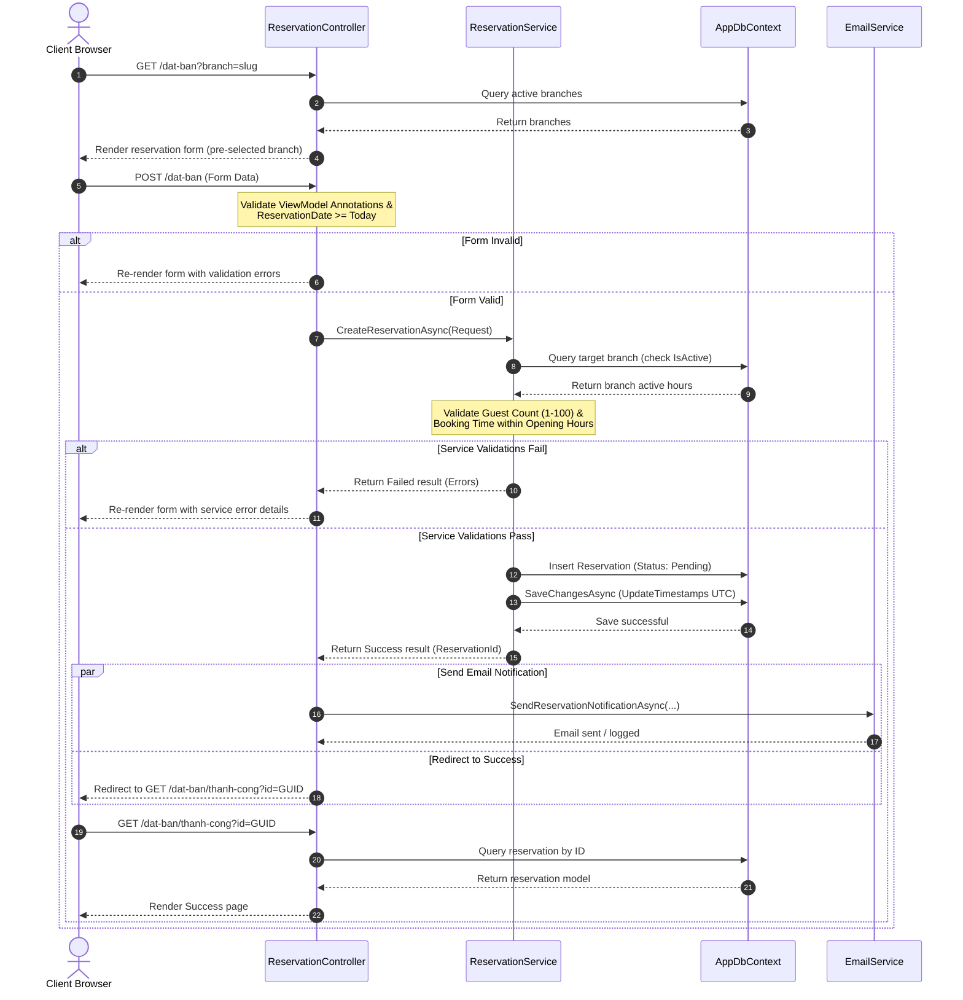
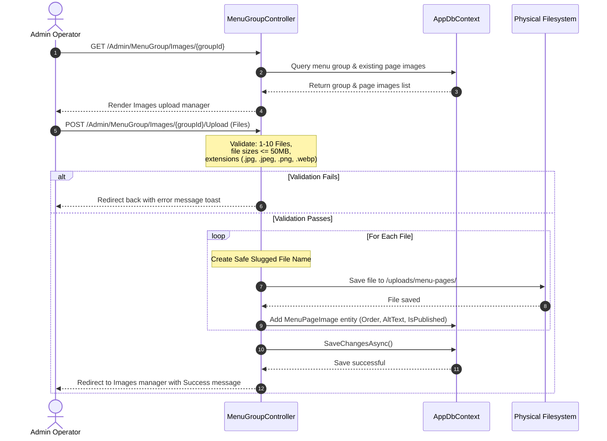

# 07 Business Flows

## 1. Reservation Creation Flow (GET & POST)

### User Goal
Book a table at a chosen branch for a specific date, time, and guest count.

### Entry Point
Public header CTA buttons, Hero CTAs, branch cards, or direct URL `/dat-ban`.

### Files Involved
* [ReservationController.cs](file:///f:/Coding/Web%20development/KIG%20Holding/KIGHolding/Controllers/ReservationController.cs) (GET/POST `Index`, POST `Quick`, GET `Success` actions)
* [ReservationService.cs](file:///f:/Coding/Web%20development/KIG%20Holding/KIGHolding/Services/ReservationService.cs)
* [ReservationCreateViewModel.cs](file:///f:/Coding/Web%20development/KIG%20Holding/KIGHolding/ViewModels/ReservationCreateViewModel.cs)
* [ReservationCreateRequest.cs](file:///f:/Coding/Web%20development/KIG%20Holding/KIGHolding/Services/ReservationCreateRequest.cs)
* `Views/Reservation/Index.cshtml` & `Success.cshtml`

### Sequence Diagram

### Validation Rules
* **Controller-Side**:
  * Date must not be in the past (`ReservationDate >= Today`).
  * Branch ID must be selected and not empty (`BranchId != Guid.Empty`).
  * Mapped database connection must be valid.
* **Service-Side**:
  * Date must not be in the past (second check).
  * Guest count must be between 1 and 100.
  * Target branch must exist and be active (`IsActive == true`).
  * Selected booking time must sit within the branch's `OpeningTime` and `ClosingTime` limits.

### Success Behavior
Redirects to GET `/dat-ban/thanh-cong?id=GUID` and triggers an asynchronous booking alert email to the staff (`truyenthuyetchamponghcm@gmail.com`).

### Failure Behavior
Re-renders the form carrying validation fields and populated metadata, displaying specific error messages next to the inputs.

---

## 2. Admin MenuGroup & Page Sheet Upload Flow

### User Goal
Create/Edit a brand MenuGroup (e.g. Gogimaru) and upload multiple menu page image sheets for flipbook rendering.

### Entry Point
Admin sidebar navigation link "Nhóm thực đơn" (`/Admin/MenuGroup`).

### Files Involved
* [MenuGroupController.cs](file:///f:/Coding/Web%20development/KIG%20Holding/KIGHolding/Areas/Admin/Controllers/MenuGroupController.cs)
* [MenuGroupFormViewModel.cs](file:///f:/Coding/Web%20development/KIG%20Holding/KIGHolding/Areas/Admin/ViewModels/MenuGroupViewModels.cs)
* `Areas/Admin/Views/MenuGroup/Index.cshtml`, `Edit.cshtml`, and `Images.cshtml`

### Sequence Diagram

### Validation Rules
* **Upload limits**: Maximum of 10 image files per upload batch.
* **File size constraints**:
  * Cover image: Maximum of 10MB.
  * Menu page sheets: Maximum of 50MB per file.
* **Allowed Extensions**: `.jpg`, `.jpeg`, `.png`, `.webp`.
* **Allowed Content Types**: `image/jpeg`, `image/png`, `image/webp`.
* **Slug check**: Validates slug uniqueness against the database (excluding current group ID on edit).

### Delete Cleanup Behavior
When an admin deletes a page sheet, the system removes the database record and calls `TryDeleteMenuPageImageFile` to delete the physical file. The path is verified using `.StartsWith("/uploads/menu-pages/")` and `Path.GetFullPath` to prevent directory traversal exploits.

---

## 3. Branch Search & Autocomplete suggestions Flow

### User Goal
Find active branch addresses, contact info, and map locations by city or search queries.

### Entry Point
Public header link "Chi nhánh" (`/chi-nhanh`).

### Data Flow
1. **Initial Render**: GET `/chi-nhanh` calls `IBranchService.GetActiveBranchesAsync()` to load all active branches.
2. **Autocomplete Setup**: The Razor view serializes active branch name, district, city, and hotline properties into a JSON DOM property (`data-branch-suggestion-data`).
3. **Suggestions Filter**: On text input (min 2 characters), [branch-locator.js](file:///f:/Coding/Web%20development/KIG%20Holding/KIGHolding/wwwroot/js/branch-locator.js) filters the JSON dataset using diacritic-insensitive matching.
4. **GET Submission**: Selecting a suggestion or submitting the form sends a GET request (e.g. `/chi-nhanh?city=Hồ+Chí+Minh&q=quan+2`).
5. **Database Filter**: `BranchController.Index` filters records in C# using diacritic-insensitive matching, returns the filtered model, and displays the corresponding map iframe.
